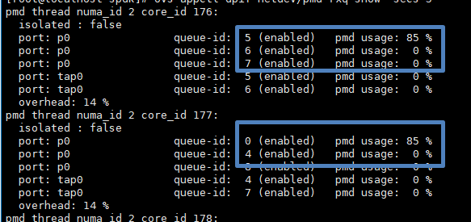

# 项目介绍<a name="ZH-CN_TOPIC_0000002440951704"></a>

鲲鹏云计算虚拟化代码仓是鲲鹏参与**开源虚拟化软件栈优化**的成果，存放**鲲鹏BoostKit虚拟化加速套件**的相关补丁，该套件覆盖**KVM**、**QEMU**、**Libvirt**、**DPDK**、**SPDK**等核心虚拟化与I/O软件栈。

-   虚拟机跨代热迁移是鲲鹏自研特性，对接qemu/kvm使用，通过引入vCPU特性读写框架，实现不同代际服务器上vCPU特性的兼容，适用于鲲鹏920与鲲鹏920新型号之间的虚拟机热迁移场景。
-   L0内存为鲲鹏自研内存加速特性，在非LLC容量敏感场景下，将**部分LLC容量作为高性能L0内存使用**，实现热点数据高性能访问。openvswitch是一个支持多层数据转发的高质量虚拟交换机。主要架构由内核态Datapath、用户态vswitchd和ovsdb组成。从网口读取的数据包，将在Datapath实现快速流表匹配，若匹配失败则上交vswitchd进行处理。L0加速内核态快速流表匹配方案是将处于内核态的Datapath转发路径卸载到L0内存上，从而加速流表查找速度，提升报文的转发效率。
-   DPDK队列选择优化是鲲鹏自研网络加速特性，对接DPDK使用，通过优化DPDK的队列选择算法，降低单个CPU压力，降低网络时延，适用于虚拟机组网为OVS+DPDK的场景。
-   SPDK中断聚合是鲲鹏自研存储性能加速特性，对接SPDK使用，通过中断聚合技术降低后端对前端的中断通知数量，减少虚拟机陷入陷出过程，提升系统整体的吞吐性能，适用于虚拟机存储为SPDK NVME场景。

# 版本说明<a name="ZH-CN_TOPIC_0000002441116972"></a>

<a name="table740710612324"></a>
<table><thead align="left"><tr id="row144075603214"><th class="cellrowborder" valign="top" width="33.33333333333333%" id="mcps1.1.4.1.1"><p id="p114078693216"><a name="p114078693216"></a><a name="p114078693216"></a>操作系统</p>
</th>
<th class="cellrowborder" valign="top" width="33.33333333333333%" id="mcps1.1.4.1.2"><p id="p84081465329"><a name="p84081465329"></a><a name="p84081465329"></a>开源软件</p>
</th>
<th class="cellrowborder" valign="top" width="33.33333333333333%" id="mcps1.1.4.1.3"><p id="p19408196163219"><a name="p19408196163219"></a><a name="p19408196163219"></a>特性</p>
</th>
</tr>
</thead>
<tbody><tr id="row64089653211"><td class="cellrowborder" valign="top" width="33.33333333333333%" headers="mcps1.1.4.1.1 "><p id="p24084615327"><a name="p24084615327"></a><a name="p24084615327"></a><span>openEuler 24.03 LTS SP1</span>（<span>6.6.0-72.0.0</span>）</p>
</td>
<td class="cellrowborder" valign="top" width="33.33333333333333%" headers="mcps1.1.4.1.2 "><p id="p1040846123216"><a name="p1040846123216"></a><a name="p1040846123216"></a>QEMU-8.2.0</p>
</td>
<td class="cellrowborder" valign="top" width="33.33333333333333%" headers="mcps1.1.4.1.3 "><p id="p19408196173215"><a name="p19408196173215"></a><a name="p19408196173215"></a>虚拟机跨代热迁移</p>
</td>
</tr>
<tr id="row44089619323"><td class="cellrowborder" valign="top" width="33.33333333333333%" headers="mcps1.1.4.1.1 "><p id="p64089617323"><a name="p64089617323"></a><a name="p64089617323"></a><span>openEuler 22.03 LTS SP4</span></p>
</td>
<td class="cellrowborder" valign="top" width="33.33333333333333%" headers="mcps1.1.4.1.2 "><p id="p540820673214"><a name="p540820673214"></a><a name="p540820673214"></a>openvswitch-2.12.4</p>
</td>
<td class="cellrowborder" valign="top" width="33.33333333333333%" headers="mcps1.1.4.1.3 "><p id="p10408369326"><a name="p10408369326"></a><a name="p10408369326"></a><span>L0加速openvswitch内核态流表匹配</span></p>
</td>
</tr>
<tr id="row54088663218"><td class="cellrowborder" valign="top" width="33.33333333333333%" headers="mcps1.1.4.1.1 "><p id="p114081164322"><a name="p114081164322"></a><a name="p114081164322"></a><span>openEuler 24.03 LTS SP1</span></p>
</td>
<td class="cellrowborder" valign="top" width="33.33333333333333%" headers="mcps1.1.4.1.2 "><p id="p540815617322"><a name="p540815617322"></a><a name="p540815617322"></a>DPDK-24.11</p>
</td>
<td class="cellrowborder" valign="top" width="33.33333333333333%" headers="mcps1.1.4.1.3 "><p id="p1140886103218"><a name="p1140886103218"></a><a name="p1140886103218"></a><span>DPDK队列选择</span></p>
</td>
</tr>
<tr id="row127821831195814"><td class="cellrowborder" valign="top" width="33.33333333333333%" headers="mcps1.1.4.1.1 "><p id="p1278214319581"><a name="p1278214319581"></a><a name="p1278214319581"></a><span>openEuler 24.03 LTS SP1</span></p>
</td>
<td class="cellrowborder" valign="top" width="33.33333333333333%" headers="mcps1.1.4.1.2 "><p id="p1778293145813"><a name="p1778293145813"></a><a name="p1778293145813"></a>SPDK-24.05</p>
</td>
<td class="cellrowborder" valign="top" width="33.33333333333333%" headers="mcps1.1.4.1.3 "><p id="p278273115810"><a name="p278273115810"></a><a name="p278273115810"></a><span>SPDK中断聚合</span></p>
</td>
</tr>
</tbody>
</table>

# 环境部署<a name="ZH-CN_TOPIC_0000002441276832"></a>

**虚拟机跨代热迁移特性 部署流程<a name="section1772123143910"></a>**

1.  到openEuler仓库拉取kernel、qemu代码。
2.  切换到对应分支，使用tools目录中的脚本完成patch应用。
3.  详细操作步骤请参见《[Kunpeng BoostKit 25.1.RC1 鲲鹏920虚拟机跨代热迁移 特性指南](https://support.huawei.com/enterprise/zh/doc/EDOC1100484197/35a9145e)》。

**L0加速openvswtich内核态流表匹配特性 部署流程<a name="section1073682415417"></a>**

1.  拉下5.10.0-216源码仓。

    ```
    git clone https://gitee.com/openeuler/kernel.git -b 5.10.0-216.0.0 --depth=1
    ```

2.  将补丁保存为.patch文件。
3.  合入补丁。

    ```
    git am --reject <补丁名称>
    ```

4.  在“kernel/net/openvswitch“目录编译openvswitch模块。

    ```
    make CONFIG_XENO_DRIVERS_NET_DRV_IGB=m -C <源码目录> M=pwd modules
    ```

**DPDK队列训责特性 部署流程<a name="section1934464794214"></a>**

1.  git拉取dpdk 24.11源代码。
2.  合入DPDK队列选择patch。
3.  编译安装dpdk 24.11。

**SPDK中断聚合特性 部署流程<a name="section1818515266438"></a>**

1.  git拉取SPDK 24.05源代码。
2.  合入SPDK中断聚合patch。
3.  编译安装spdk 24.05。

# 快速上手<a name="ZH-CN_TOPIC_0000002474516797"></a>


## 跨代热迁移<a name="ZH-CN_TOPIC_0000002474636969"></a>

完成环境部署后，参照部署文档方式启动虚拟机，执行如下命令进行跨代迁移测试，观察迁移过程能否执行完毕并无报错。

```
virsh migrate --verbose --persistent --live --unsafe <虚拟机名称> qemu+tcp://<目的端物理机IP地址>/system
```

## L0内存加速<a name="ZH-CN_TOPIC_0000002441116976"></a>

1.  加载L0模块。

    ```
    modprobe hisi_l3t
    modprobe hisi_l0
    ```

2.  停止已经开启的openvswitch服务。

    ```
    service openvswitch status
    service openvswitch stop
    ovs-ctl stop
    ```

3.  加载编译出来的openvswitch.ko。

    ```
    insmod openvswitch.ko
    ```

4.  加载openvswitch.ko后，正常启动openvswitch服务即可使用L0内存加速的内核态快速匹配流表。

## DPDK队列选择优化<a name="ZH-CN_TOPIC_0000002442189534"></a>

完成环境部署后，在虚拟机内执行iperf打流测试，在物理机执行以下命令观测PMD轮训核的压力是否平均分配。

```
ovs-appctl dpif-netdev/pmd-rxq-show -secs 5
```



## SPDK中断聚合优化<a name="ZH-CN_TOPIC_0000002475309653"></a>

完成环境部署后，使用fio工具测试4U8G虚拟机SPDK NVME磁盘性能，与物理机性能进行对比，观测虚拟化损耗是否低于10%。

# 贡献指南<a name="ZH-CN_TOPIC_0000002441276836"></a>

如果使用过程中有任何问题，或者需要反馈特性需求和bug报告，可以提交Issue联系我们，具体贡献方法可参考[这里](https://gitcode.com/boostkit/community/blob/master/docs/contributor/contributing.md)。

# 免责声明<a name="ZH-CN_TOPIC_0000002474516801"></a>

此代码仓计划参与虚拟化核心软件开源，仅作虚拟机热迁移功能扩展以及网络与存储性能提升，编码风格遵照原生开源软件，继承原生开源软件安全设计，不破坏原生开源软件设计及编码风格和方式，软件的任何漏洞与安全问题，均由相应的上游社区根据其漏洞和安全响应机制解决。请密切关注上游社区发布的通知和版本更新。鲲鹏计算社区对软件的漏洞及安全问题不承担任何责任。其中，跨代热迁移代码仅为技术参考，展示跨代热迁移的使用方式与集成方法，不用于生产环境，不继承或承诺任何上下游软件的安全设计与防护机制，使用者应自行评估风险，并根据实际场景进行安全加固。任何因使用本仓库代码所引发的安全问题，均由使用者自行承担。

# 许可证书<a name="ZH-CN_TOPIC_0000002474636973"></a>

本项目采用Apache License 2.0许可证。详见[LICENSE](https://gitcode.com/boostkit/cloud-virtual/blob/master/LICENSE)文件。
本项目的文档适用CC-BY 4.0许可证，具体请参见[LICENSE](https://gitcode.com/boostkit/cloud-virtual/blob/master/docs/LICENSE)文件。
