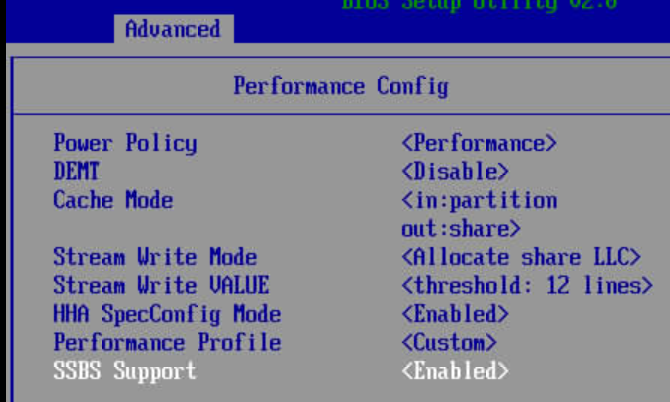
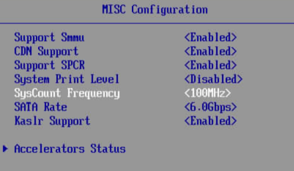
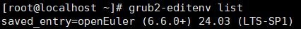
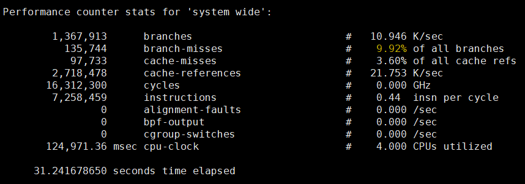
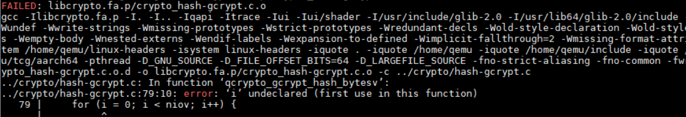

# Kunpeng 920 Cross-Generation VM Live Migration Feature Guide<a name="EN-US_TOPIC_0000002521252894"></a>

## Feature Description<a name="EN-US_TOPIC_0000002549771341"></a>

### Introduction<a name="EN-US_TOPIC_0000002549891359"></a>

This document details the procedure for performing unidirectional cross-generation live migration of VMs from a Kunpeng 920 server to a new Kunpeng 920 server model within an openEuler OS environment.

VM live migration allows a VM to be migrated from one physical host to another without interrupting the VM running. The key benefit of cross-generation migration lies in its ability to maintain VM operation and service continuity during hardware upgrades by supporting migration between different hardware generations. Successful implementation typically requires sufficient compatibility between source and target hardware platforms, and hardware discrepancy tolerance at the VM OS and application layers. While technically challenging, this capability significantly enhances operational flexibility for data centers and cloud services by ensuring continuous service availability.


### Other Information<a name="EN-US_TOPIC_0000002518251592"></a>

Before configuring this feature, learn about the constraints and application scenarios.

**Specifications<a name="section186211624175715"></a>**

Supported VM specifications include but are not limited to 2 vCPUs with 8 GB memory, 4 vCPUs with 8 GB memory, 4 vCPUs with 16 GB memory, 8 vCPUs with 16 GB memory, 16 vCPUs with 32 GB memory, and 32 vCPUs with 64 GB memory.

**Version Requirements<a name="section1625164615574"></a>**

- Supported versions: Only kernel 6.6.0 and QEMU 8.2.0 are supported.
- License requirement: none.

**Constraints<a name="section3897196125818"></a>**

The application environment must meet the hardware and software requirements.

**Application Scenarios<a name="section49961711506"></a>**

VM live migration applies to load balancing, hardware maintenance, and disaster recovery (DR) high availability (HA) scenarios. It dynamically adjusts VM distribution to prevent a single physical host from being overloaded and improve resource utilization. VMs can be migrated without interrupting services to facilitate the maintenance or upgrade of the source host. In addition, when a host is faulty or its performance deteriorates, VMs can be quickly migrated to ensure service continuity.


## Installation and Usage<a name="EN-US_TOPIC_0000002549771343"></a>

### Environment Requirements<a name="EN-US_TOPIC_0000002549891357"></a>

This document provides guidance based on the openEuler OS. Before performing operations, ensure that your hardware and software meet the requirements.

**Hardware Requirements<a name="section26241127"></a>**

[**Table 1**](#hardware-requirements) lists the hardware requirements.

**Table 1** Hardware requirements<a id="hardware-requirements"></a>

|Item|Description|
|--|--|
|Source processor|Kunpeng 920|
|Target processor|New Kunpeng 920 processor model|


**iBMC and BIOS Version Requirements<a name="section4793193042413"></a>**

[**Table 2**](#ibmc-and-bios-version-requirements) lists the iBMC and BIOS version requirements.

**Table 2** iBMC and BIOS version requirements<a id="ibmc-and-bios-version-requirements"></a>

|Item|Version|
|--|--|
|Source iBMC|V3.03 or later|
|Source BIOS|V5.29 or later|
|Target iBMC|V5.0 or later|
|Target BIOS|V20.0 or later|


**OS and Software Requirements<a name="section153345522323"></a>**

[**Table 3**](#os-and-software-requirements) lists the OS and software requirements.

**Table 3** OS and software requirements<a id="os-and-software-requirements"></a>

|Item|Version|How to Obtain|
|--|--|--|
|OS|openEuler 24.03 LTS SP1|[Link](https://dl-cdn.openeuler.openatom.cn/openEuler-24.03-LTS-SP1/ISO/aarch64/openEuler-24.03-LTS-SP1-aarch64-dvd.iso)|
|Kernel|6.6.0-72|Source code: [Link](https://gitcode.com/openeuler/kernel/tree/6.6.0-72.0.0)<br>Patch: [Link](https://gitcode.com/boostkit/cloud-virtual/tree/master/kernel/kernel-6.6.0)|
|libvirt|9.10.0|Install it using a Yum repository.|
|QEMU|8.2.0|Source code: [Link](https://gitcode.com/openeuler/qemu/tree/qemu-8.2.0)<br>Patch: [Link](https://gitcode.com/boostkit/cloud-virtual/tree/master/qemu/qemu-8.2.0)|
|Redis|6.2.7|Install it using a Yum repository.|
|Nginx|1.24.0|Install it using a Yum repository.|
|Perf|6.6.0-89.0.0.94|Install it using a Yum repository.|

### Configuring the BIOS<a name="EN-US_TOPIC_0000002518411504"></a>

#### Configuring the Source Server BIOS<a name="EN-US_TOPIC_0000002549771345"></a>

To ensure SSBS feature consistency between the source and target servers, upgrade the source server BIOS and firmware to the versions required by this document and configure the BIOS settings of the source Kunpeng 920 server to enable SSBS.

1. Restart the source physical machine and go to the BIOS page.
2. Set `SSBS Support` under `Advanced` > `Performance Config` to `Enabled`.

    


#### Configuring the Target Server BIOS<a name="EN-US_TOPIC_0000002518411502"></a>

The Kunpeng 920 server does not support GICv4.1 and the system counter frequency is 100 MHz. Therefore, you need to modify the BIOS options of the target new Kunpeng 920 server model.

1. Restart the target physical machine and go to the BIOS page.
2. Set `GIC Version` under `Advanced` > `Processor Configuration` to `4.0`.

    

3. Set `SysCount Frequency` under `Advanced` > `MISC Configuration` to `100MHz`.

    


### Compiling and Installing the Server Kernel<a name="EN-US_TOPIC_0000002518251594"></a>

Install openEuler 24.03 LTS SP1 on both the source Kunpeng 920 server and the target new Kunpeng 920 server model, and compile and install the customized kernel 6.6.

> **NOTICE:**
>-   The feature installation involves system file modification. By default, all operations during the installation are performed by the `root` user. If you are a non-`root` user, ensure that you have corresponding permissions.
>-   Modify paths and file names involved in the kernel compilation and installation as required.
>-   Configure the Yum repository in advance.

1. Install the dependencies required for kernel compilation.

    ```
    yum -y install rpm-build openssl-devel bc rsync gcc gcc-c++ flex bison m4 git glib2-devel spice-protocol zlib-devel libffi-devel libgcrypt-devel libnfs-devel libiscsi-devel libseccomp-devel libaio-devel libcap-ng-devel librados2-devel librbd1-devel libfdt-devel libpng-devel spice-server-devel numactl-devel dwarves elfutils-libelf-devel ncurses-devel cmake make liburing-devel ninja-build
    ```

2. Obtain the open-source code of the kernel and go to tag `6.6.0-72.0.0`.

    ```
    cd /home
    git clone https://gitee.com/openeuler/kernel.git
    cd kernel
    git checkout 6.6.0-72.0.0
    git switch --detach 5f2e69404ccc6b0a60f370b25310213b19b657c1
    ```

3. Obtain the kernel patch and apply the patch to the open-source code.

    ```
    cd /home
    git clone https://gitee.com/kunpeng_compute/boostkit_-virtualization.git
    cp /home/boostkit_-virtualization/tools/[live-migration]apply_patches.py /home/kernel/
    cd /home/kernel
    python3 [live-migration]apply_patches.py /home/boostkit_-virtualization/kernel/kernel-6.6.0
    ```

4. Copy the current system configuration file as the compilation configuration file and modify it as follows:

    ```
    cp /boot/config-6.6.0-72.0.0.76.oe2403sp1.aarch64 .config
    vim .config
    CONFIG_SYSTEM_TRUSTED_KEYS=""
    ```

5. Generate the compilation configuration. After the execution is successful, exit directly.

    ```
    make menuconfig
    ```

6. Compile the kernel.

    ```
    make binrpm-pkg -j
    ```

7. Install the kernel and update the boot file.

    > **NOTE:**
    >Modify the path for generating the compiled RPM package as required.

    ```
    rpm -ivh /root/rpmbuild/RPMS/aarch64/kernel-6.6.0-1.aarch64.rpm --force
    grub2-mkconfig -o /boot/efi/EFI/openEuler/grub.cfg
    ```

8. Modify the kernel startup parameter.

    ```
    vi /boot/efi/EFI/openEuler/grub.cfg
    ```

    Add the following content to the startup parameters of the newly installed kernel.

    

    ```
    arm64.nopauth console=tty0 selinux=0 iommu.passthrough=1 pci=realloc
    ```

    Set the new kernel as the default boot kernel and check whether the setting is successful.

    ```
    grub2-set-default "openEuler (6.6.0+) 24.03 (LTS-SP1)"
    grub2-editenv list
    ```

    

9. Restart the system, enter the BMC, and switch to the new kernel.

    ```
    reboot
    ```

### Compiling and Installing QEMU<a name="EN-US_TOPIC_0000002518411500"></a>

Compile and install the customized QEMU 8.2.0 on both the source Kunpeng 920 server and the target new Kunpeng 920 server model.

1. Obtain the open-source code of QEMU and go to branch `qemu-8.2.0`.

    ```
    cd /home
    git clone https://gitee.com/openeuler/qemu.git
    cd qemu
    git switch qemu-8.2.0
    git switch --detach 5830dea26e69c47c9ec46d12662c24d1c4ac8436
    ```

2. Obtain the QEMU patch and apply the patch to the open-source code.

    ```
    cd /home
    git clone https://gitee.com/kunpeng_compute/boostkit_-virtualization.git
    cp /home/boostkit_-virtualization/tools/[live-migration]apply_patches.py /home/qemu/
    cd /home/qemu
    python3 [live-migration]apply_patches.py /home/boostkit_-virtualization/qemu/qemu-8.2.0
    ```

3. Configure QEMU compilation options.

    ```
    mkdir build
    cd build
    ../configure --prefix=/usr/local/qemu-8.2.0 --disable-werror --enable-spice --enable-spice-protocol --target-list=aarch64-softmmu --cc="gcc" --extra-cflags="-Wno-error" --disable-docs --enable-virtfs --enable-numa --enable-kvm
    ```

4. Compile and install QEMU. If the compilation fails, see the important notes at the end of this document.

    ```
    make -j && make install
    ```

### Installing libvirt<a name="EN-US_TOPIC_0000002518251590"></a>

Use Yum to install libvirt on both the source and target servers.

```
yum -y install libvirt edk2-aarch64.noarch
```


### Modifying the System and libvirt Configurations<a name="EN-US_TOPIC_0000002518251596"></a>

**Modifying System Configurations<a name="section4375102616228"></a>**

> **NOTE:**
>-   Change the IP address and host name as required.
>-   Before modifying the configurations, disable the security protection measures of the source and target physical machines.

1. On the source and target physical machines, modify the `/etc/selinux/config` file as follows and restart to disable SELinux.

    ```
    SELINUX=disabled
    ```

2. Disable the firewall on the target physical machine.

    ```
    systemctl stop firewalld
    ```

3. Change the host name of the target physical machine.

    ```
    hostname target
    ```

4. Modify the `/etc/hosts` file on the source physical machine and add the IP address and host name of the target physical machine. The IP address must be the same as that used in the migration command.

    ```
    XXX.XXX.XXX.XXX target
    ```

**Modifying libvirt Configurations<a name="section1807451083"></a>**

Modify the `/etc/libvirt/libvirtd.conf` file on the target physical machine to enable libvirt to monitor the VM status during live migration. Let libvirt listen to port 16509 on all network interfaces through TCP.

> **NOTICE:**
>The following configurations are usually used in development and test environments or scenarios with low security requirements. For enhanced security, further configurations are needed for aspects like the listening address, authentication, and encryption protocols.

1. Modify the `/etc/libvirt/libvirtd.conf` file on the target server to enable libvirt to monitor the VM status during live migration.

    ```
    listen_tls = 0
    listen_tcp = 1
    tcp_port = "16509"
    listen_addr = "0.0.0.0"
    auth_tcp = "none"
    ```

2. Restart the libvirtd service to enable listening.

    ```
    systemctl stop libvirtd 
    systemctl enable --now libvirtd-tcp.socket
    systemctl daemon-reload
    systemctl restart libvirtd
    ```


### Setting Up the Network Bridge<a name="EN-US_TOPIC_0000002549771347"></a>

In this test environment, Kunpeng 920 cross-generation VM live migration uses the Linux bridge for network communication.

> **NOTICE:**
>-   You need to configure a network bridge for both the source and target physical machines.
>-   If the source physical machine is directly connected to the target physical machine, you do not need to configure the gateway.
>-   The network bridge name of the source physical machine must be the same as that of the target.
>-   The source and target physical machines must be in the same network segment.
>-   The IP address of the VM must be in the same network segment as that of the network bridge.

1. Create a network bridge interface.

    ```
    brctl addbr <Network_bridge_name>
    ```

2. Bind the NIC.

    If the NIC has an IP address, clear the IP address.

    ```
    ip addr flush dev <NIC_name>
    ```

    Bind the NIC to the network bridge.

    ```
    ip link set <NIC_name> master <Network_bridge_name>
    ```

3. Start the interface.

    ```
    sudo ip link set <Network_bridge_name> up
    sudo ip link set <NIC_name> up
    ```

4. Check whether the binding is successful.

    ```
    brctl show
    ```

    If the binding is successful, the following information is displayed:

    

    > **NOTICE:**
    >bridge-utils must be installed.

5. Configure the IP address and gateway of the network bridge.

    ```
    ip addr add <IP_address> dev <Network_bridge_name>
    ip route add default via <Gateway_IP_address> dev <Network_bridge_name>
    ```

6. Modify the VM XML file to bind the network bridge.

    ```
    virsh edit <VM_name>
    <interface type='bridge'>
      <mac address='<MAC_address>'/>
      <source bridge='<Network_bridge_name>'/>
      <model type='virtio'/>
      <address type='pci' domain='0x0000' bus='0x0b' slot='0x00' function='0x0'/>
    </interface>
    ```

    The command for configuring the IP address is as follows:

    ```
    ip addr add <IP_address> dev <Virtual_NIC_name>
    ```

7. Test the connectivity.

    On the target physical machine, run the following command to check whether the VM network is normal. If the network connection is normal, the network is successfully set up.

    ```
    ping <Virtual_NIC_IP_address>
    ```

### Configuring the XML File of the Source VM<a name="EN-US_TOPIC_0000002549891363"></a>

The following uses a VM with 4 vCPUs and 8 GB memory as an example. Modify the XML file of the source VM following these steps.

1. Edit the XML file of the source VM.

    ```
    virsh edit <VM_name>
    ```

2. Specify the path of the QEMU binary file used for VM startup.

    ```
    <emulator>/usr/local/qemu-8.2.0/bin/qemu-system-aarch64</emulator>
    ```

3. Modify the QEMU startup parameters to unify the vCPU features, number of PMU counters, types of PMU statistical events, and Errata management.

    ```
     <domain type='kvm' xmlns:qemu='http://libvirt.org/schemas/domain/qemu/1.0'>
       <qemu:commandline>
          <qemu:arg value='-cpu'/>
          <qemu:arg value='host,SYSREG_ID_AA64PFR0_EL1_CSV3=0x0,SYSREG_ID_AA64PFR0_EL1_CSV2=0x0,SYSREG_ID_AA64PFR0_EL1_DIT=0x0,SYSREG_ID_AA64PFR0_EL1_AMU=0x0,SYSREG_ID_AA64PFR0_EL1_SEL2=0x0,SYSREG_ID_AA64PFR0_EL1_SVE=0x0,SYSREG_ID_AA64PFR0_EL1_RAS=0x1,SYSREG_ID_AA64PFR0_EL1_GIC=0x1,SYSREG_ID_AA64PFR1_EL1_BT=0x0,SYSREG_ID_AA64PFR1_EL1_BT=0x0,SYSREG_ID_AA64ISAR0_EL1_RNDR=0x0,SYSREG_ID_AA64ISAR0_EL1_TLB=0x0,SYSREG_ID_AA64ISAR0_EL1_TS=0x0,SYSREG_ID_AA64ISAR0_EL1_SM4=0x0,SYSREG_ID_AA64ISAR0_EL1_SM3=0x0,SYSREG_ID_AA64ISAR0_EL1_SHA3=0x0,SYSREG_ID_AA64ISAR0_EL1_SHA2=0x1,SYSREG_ID_AA64ISAR1_EL1_I8MM=0x0,SYSREG_ID_AA64ISAR1_EL1_DGH=0x0,SYSREG_ID_AA64ISAR1_EL1_BF16=0x0,SYSREG_ID_AA64ISAR1_EL1_SPECRES=0x0,SYSREG_ID_AA64ISAR1_EL1_SB=0x0,SYSREG_ID_AA64ISAR1_EL1_FRINTTS=0x0,SYSREG_ID_AA64ISAR1_EL1_LRCPC=0x0,SYSREG_ID_AA64ISAR1_EL1_DPB=0x1,SYSREG_ID_AA64MMFR0_EL1_ECV=0x0,SYSREG_ID_AA64MMFR0_EL1_TGRAN4_2=0x0,SYSREG_ID_AA64MMFR0_EL1_TGRAN64_2=0x0,SYSREG_ID_AA64MMFR0_EL1_TGRAN16_2=0x0,SYSREG_ID_AA64MMFR1_EL1_TWED=0x0,SYSREG_ID_AA64MMFR1_EL1_HPDS=0x1,SYSREG_ID_AA64MMFR2_EL1_E0PD=0x0,SYSREG_ID_AA64MMFR2_EL1_EVT=0x0,SYSREG_ID_AA64MMFR2_EL1_BBM=0x0,SYSREG_ID_AA64MMFR2_EL1_TTL=0x0,SYSREG_ID_AA64MMFR2_EL1_FWB=0x0,SYSREG_ID_AA64MMFR2_EL1_IDS=0x0,SYSREG_ID_AA64MMFR2_EL1_AT=0x0,SYSREG_ID_AA64MMFR2_EL1_ST=0x0,SYSREG_ID_AA64MMFR2_EL1_CCIDX=0x0,SYSREG_ID_AA64MMFR2_EL1_IESB=0x0,SYSREG_ID_AA64DFR0_EL1_PMUVer=0x4,SYSREG_ID_AA64DFR0_EL1_DebugVer=0x8,SYSREG_ID_AA64ZFR0_EL1_F64MM=0x0,SYSREG_ID_AA64ZFR0_EL1_F32MM=0x0,SYSREG_ID_AA64ZFR0_EL1_I8MM=0x0,SYSREG_ID_AA64ZFR0_EL1_BF16=0x0'/>
          <qemu:arg value='-machine'/>
          <qemu:arg value='pmcr-n=8,denied-events-type.0=bus-cycles,denied-events-type.1=l1i-cache-lmiss,denied-events-type.2=l3d-cache-allocate,denied-events-type.3=l3d-cache-refill,denied-events-type.4=l3d-cache,denied-events-type.5=l1d-cache-lmiss-rd,denied-events-type.6=op-spec,denied-events-type.7=stall,denied-events-type.8=stall-slot-backend,denied-events-type.9=stall-slot-frontend,denied-events-type.10=stall-slot,denied-events-type.11=ldst-align-lat,denied-events-type.12=ld-align-lat,denied-events-type.13=st-align-lat,x-target-impl-cpus=0x481fd010:0x0-0x480fd020:0x0'/>
       </qemu:commandline>
    ```


## Live Migration Test<a name="EN-US_TOPIC_0000002549891361"></a>

### Testing Functions<a name="EN-US_TOPIC_0000002518411506"></a>

> **NOTICE:**
>To install software on the VM, you need to configure the Yum repository in advance.

**Installing Redis<a name="section7262191845011"></a>**

Redis is used only to verify service continuity during live migration. You can use any Redis version. The following uses 6.2.7 as an example, which is the version provided by the Yum repository. Run the following command on the VM to install it:

```
yum install -y redis6
```

**Installing Perf<a name="section11529195313920"></a>**

Perf is a system performance analysis tool. It is used to verify the live migration of VM PMU events. You can use the version provided by the Yum repository. Run the following command on the VM to install it:

```
yum install -y perf
```

**Testing the Live Migration Function<a name="section656254144515"></a>**

> **NOTICE:**
>If the VM drive image is not stored on a shared storage device, copy the VM drive image to the same directory on the target physical machine in advance.

1. Start the source VM.

    ```
    virsh start <VM_name> --console
    ```

2. Modify the Redis configuration file `/etc/redis/redis.conf`.

    ```
    bind <VM_NIC_IP_address>
    protected-mode no
    daemonize no
    ```

3. Disable the VM firewall and start Redis.

    ```
    systemctl stop firewalld
    systemctl start redis
    ```

4. Enable PMU event collection. The number and types of events can be customized based on the chip support. The following uses collection of 10 events as an example.

    ```
    perf stat -e branches,branch-misses,cache-misses,cache-references,cycles,instructions,alignment-faults,bpf-output,cgroup-switches,cpu-clock
    ```

5. Initiate the stress test from the Redis client.

    ```
    redis-benchmark -h <VM_IP_address> -n 10000000 -c 1000 -r 10000000  -t get -p 6379 --threads 20
    ```

6. Perform VM live migration on the source physical machine.

    ```
    virsh migrate --verbose --persistent --live --unsafe <VM_name> qemu+tcp://<IP_address_of_the_target_physical_machine>/system
    ```

7. Verify that the migration process completes successfully, ensuring the progress bar reaches 100% and terminates without error information.

    

8. After the migration is complete, access the VM on the target physical machine, press `Ctrl` + `C` to interrupt the perf collection process, and check whether the perf program outputs the following information:

    

9. After the migration is complete, check whether the stress test can be completed normally on the client physical machine and output the final requests per second (RPS) result.

    


### Testing Performance<a name="EN-US_TOPIC_0000002518411508"></a>

**Installing Nginx<a name="section7262191845011"></a>**

Nginx is used only to verify service continuity during live migration. You can use any Nginx version. The following uses 1.24.0 as an example, which is the version provided by the Yum repository. Run the following command on the VM to install it:

```
yum install -y nginx
```

**Installing Wrk<a name="section207631924185917"></a>**

Wrk is the Nginx client stress test software. You can use any version. The following uses 4.2.0 as an example to describe how to install the software.

1. Obtain the [wrk-4.2.0](resource/wrk-4.2.0.zip) package from the client physical machine, save the package to the `/home` directory, and run the following commands:

    ```
    unzip wrk-4.2.0.zip
    cd wrk-4.2.0
    make
    cp wrk /usr/local/bin/
    ```

2. Run the following command:

    ```
    wrk -v
    ```

    If information similar to the following is displayed, wrk is successfully installed.

    

**Testing the Live Migration Performance<a name="section656254144515"></a>**

> **NOTICE:**
>If the VM drive image is not stored on a shared storage device, copy the VM drive image to the same directory on the target physical machine in advance.

1. Start the source VM.

    ```
    virsh start <VM_name> --console
    ```

2. Generate a self-signed certificate for testing.

    ```
    mkdir -p /etc/nginx/ssl
    openssl req -x509 -nodes -days 365 -newkey rsa:2048 \
      -keyout /etc/nginx/ssl/server.key \
      -out /etc/nginx/ssl/server.crt \
      -subj "/CN=localhost"
    ```

3. Modify the Nginx configuration file `/etc/nginx/nginx.conf`.

    ```
    server {
        listen 20000 ssl;
        server_name localhost;
    
        ssl_certificate     /etc/nginx/ssl/server.crt;
        ssl_certificate_key /etc/nginx/ssl/server.key;
    
        ssl_protocols       TLSv1.2 TLSv1.3;
        ssl_ciphers         HIGH:!aNULL:!MD5;
        ssl_prefer_server_ciphers on;
    
        location / {
            root   /usr/share/nginx/html;
            index  index.html index.htm;
        }
    }
    
    ```

4. Disable the VM firewall and start Nginx.

    ```
    systemctl stop firewalld
    setenforce 0
    systemctl start nginx
    ```

5. Initiate the stress test from the Nginx client and start the ping test.

    ```
    wrk -H "Connection: Close" -c 800 -t 100 -d 120s https://<VM_IP_address>:20000/index.html
    ping -i 0.01 <VM_IP_address>
    ```

6. Perform VM live migration on the source physical machine.

    ```
    virsh migrate --verbose --persistent --live --unsafe <VM_name> qemu+tcp://<IP_address_of_the_target_physical_machine>/system
    ```

7. Verify that the migration process completes successfully, ensuring the progress bar reaches 100% and terminates without error information.

    

8. After the migration is complete, check whether the stress test can be completed normally on the client physical machine and output the final RPS result.

    

9. After the migration is complete, stop the ping test and check whether the number of lost packets is less than 20.

    

**Important Notes<a name="section848012533393"></a>**

- During migration testing, the VM drive image may occasionally become corrupted. After successful migration, error messages similar to the following may appear when you use the VM.

    

    To resolve this issue, follow these steps:

    1. Restart the VM into emergency mode.
    2. Run the `fsck -y /dev/mapper/openeuler-root` command in emergency mode to repair.
    3. Restart the VM after the repair.

- After the migration, the VM shows the CPU frequency of the source physical machine rather than matching the target machine frequency. Single-core performance testing confirms that this is purely a display issue with no actual impact on the VM CPU performance.

    

- During QEMU compilation, the following undefined variable error may occur.

    

    To resolve this issue, follow these steps:

    1. Edit the file where the error occurs.

        ```
        vim ../crypto/hash-gcrypt.c
        ```

    2. Add a definition for the variable `i` on the line that caused the error, then save the file and exit.

        ```
        for (int i = 0;i < niov; i++)
        ```

    3. Compile QEMU again.
