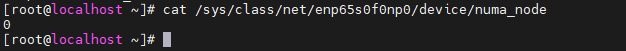
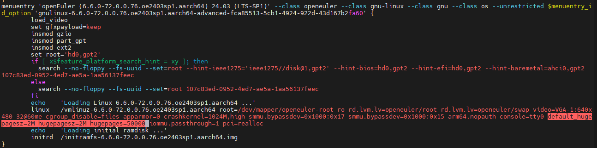
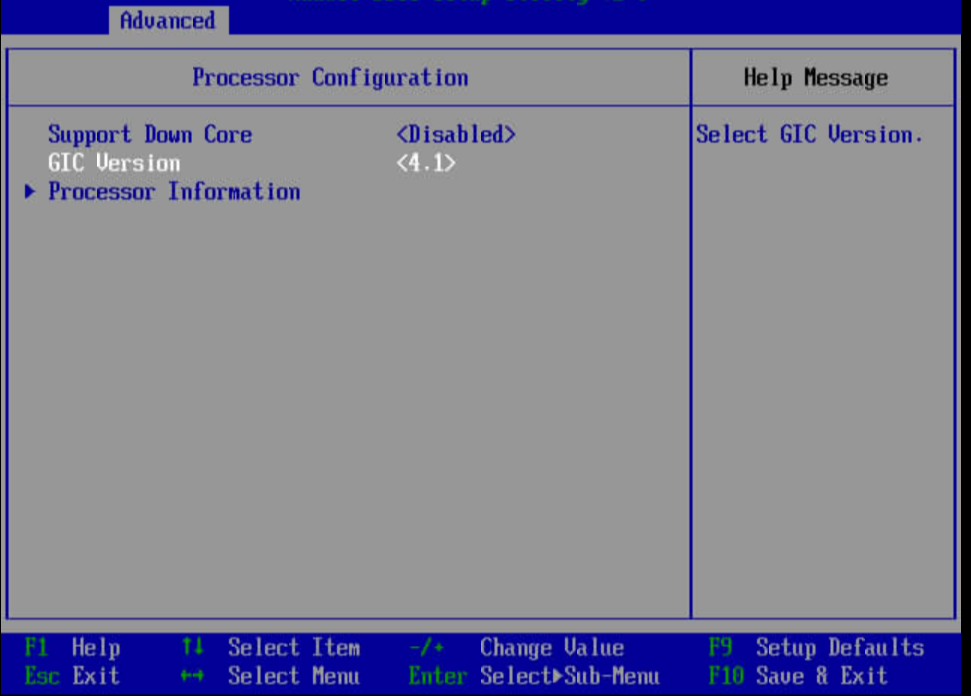
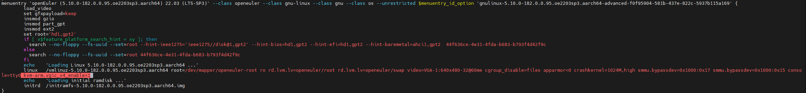
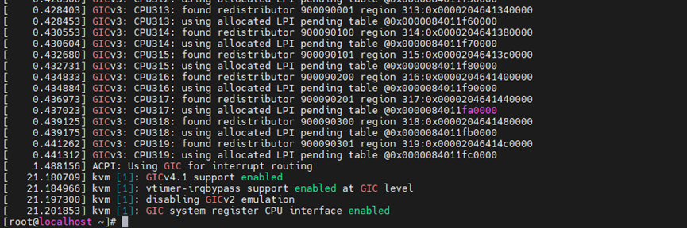

# Kunpeng Virtualization Loss Optimization Guide<a name="EN-US_TOPIC_0000002552293499"></a>

## Overview<a name="EN-US_TOPIC_0000002518251754"></a>

This document describes how to adjust the virtualization parameters of Kunpeng servers in KVM-based virtualization environments to minimize the performance loss caused by virtualization when compared to physical machine performance.

In KVM-based virtualization environments, while hardware-assisted virtualization significantly reduces overhead, performance loss persists under heavy workloads. Key contributors include VM-exit events, memory virtualization overheads, and I/O virtualization bottlenecks, all potentially creating substantial performance differentials between virtual and physical machines. For mission-critical VMs, these virtualization penalties can manifest as reduced resource utilization, increased latency, constrained throughput, and ultimately failure to meet service performance requirements. To address these challenges, this document provides targeted optimization methodologies for virtualized network and storage subsystems, enabling optimized performance in virtualization environments.


## Environment Requirements<a name="EN-US_TOPIC_0000002549771521"></a>

This section describes the hardware and software requirements of the server to be optimized.

Kunpeng virtualization loss optimization is applicable to VMs with 4 vCPUs and 8 GB memory or 32 vCPUs and 64 GB memory.

**Hardware Requirements<a name="section1815816277716"></a>**

[**Table 1**](#hardware-requirements) lists the hardware requirements.

**Table 1** Hardware requirements<a id="hardware-requirements"></a>

|Item|Description|
|--|--|
|Server|Kunpeng server|
|Processor|2 × new Kunpeng 920 processor model|
|Memory|Populate one DIMM Per Channel (1DPC) to maximize the memory performance. That is, populate all DIMM 0 slots first.|


**Software Requirements<a name="section102619448716"></a>**

[**Table 2**](#software-requirements) describes the software requirements.

**Table 2** Software requirements<a id="software-requirements"></a>

|Item|Version|How to Obtain|
|--|--|--|
|OS|openEuler 24.03 LTS SP1|Physical machine ISO image: [Link](https://repo.openeuler.org/openEuler-24.03-LTS-SP1/ISO/aarch64/openEuler-24.03-LTS-SP1-everything-aarch64-dvd.iso)<br>VM QCOW2 image: [Link](https://repo.openeuler.org/openEuler-24.03-LTS-SP1/virtual_machine_img/aarch64/openEuler-24.03-LTS-SP1-aarch64.qcow2.xz)|
|libvirt|9.10.0|Install it using a Yum repository.|
|QEMU|8.2.0|Install it using a Yum repository.|
|iPerf3|3.16-3.oe2403sp1|Install it using a Yum repository.|
|qperf|0.4.11-1.oe2403sp1|Install it using a Yum repository.|
|fio|3.34|Install it using a Yum repository.|


## Network Loss Optimization<a name="EN-US_TOPIC_0000002518251758"></a>

### Optimizing VM Placement<a name="EN-US_TOPIC_0000002518411674"></a>

Running a VM on the same NUMA node as its NIC minimizes cross-node memory access and resource contention, significantly reducing network I/O latency while improving throughput.

In the NUMA architecture, local memory access is substantially faster than remote memory access. When vCPUs and memory of a VM are allocated on the same NUMA node as its NIC, data transfers (including network packet processing) occur entirely through local memory, eliminating the additional latency and bandwidth loss of cross-node communication.

```
cat /sys/class/net/<NIC_name>/device/numa_node
```

For example, querying the NUMA node for NIC `enp65s0f0np0` reveals that it resides on node 0. Consequently, the vCPUs of the VM should be bound to physical CPU cores within NUMA node 0.




### Enabling Huge Page Memory<a name="EN-US_TOPIC_0000002518411670" id="enabling-huge-page-memory"></a>

Enabling huge page memory minimizes page table hierarchy levels for memory access and reduces TLB misses, which substantially lowers memory management overhead during network protocol stack operations. This optimization results in improved network throughput and reduced latency.

1. Modify the kernel cmdline startup parameters. The following method adds the target huge page size and quantity to the startup parameters, enabling huge pages permanently.
    1. Open the `grub2-efi.cfg` file.

        ```
        vim /etc/grub2-efi.cfg
        ```

    2. Press `i` to enter the insert mode and add `default_hugepagesz=2M hugepagesz=2M hugepages=50000` to cmdline. As shown in the following figure, the default huge page size is 2 MB and the number of huge pages is 50,000.

        

    3. Press `Esc` to exit the insert mode. Type `:wq!` and press `Enter` to save the file and exit.
    4. Run the `reboot` command to restart the server.

2. Check the huge page configuration.

    ```
    cat /proc/sys/vm/nr_hugepages
    ```

    

3. Configure huge pages in the VM XML file.

    ```
    virsh edit <VM_name>
    ```

    Specify the size in `page size`, that is, the size of the huge page memory enabled for the VM.

    ```
    <domain type = 'KVM'>
    ...
      <memoryBacking>
        <hugepages>
          <page size='2048' unit='KiB'/>
        </hugepages>
      </memoryBacking>
    ...
    <domain>
    ```


### Enabling GICv4.1<a name="EN-US_TOPIC_0000002549891511" id="enabling-gicv4.1"></a>

GICv4.1 incorporates interrupt direct injection capabilities like vLPI passthrough for devices and vSGI passthrough. These features dramatically decrease VM-exit and VM-entry occurrences in heavily loaded VMs, resulting in enhanced VM performance.

1. Modify BIOS settings.

    In `BIOS` > `Advanced` > `Processor Configuration`, change `GIC Version` to `4.1`. See the following figure.

    

2. Modify the kernel cmdline startup parameters.

    Add `kvm-arm.vgic_v4_enable=1` to cmdline. Restart the server.

    

3. Ensure that GICv4.1 is enabled.

    Run the `dmesg | grep GIC` command on the host. If "kvm [1]: GICv4.1 support enabled" is displayed, GICv4.1 is enabled.

    

> **NOTE:**
>When the network bandwidth is tested on a VM with 4 vCPUs and 8 GB memory, network interrupts and application workloads run simultaneously across all four vCPUs due to the limited number of cores. For controlled testing of network bandwidth across four CPU cores on a physical machine, both network interrupts and service operations must be confined to those same four cores.


### Optimizing OVS+DPDK<a name="EN-US_TOPIC_0000002549771523"></a>

VirtIO+OVS+DPDK is a common high-performance virtualization network solution. In this architecture, the frontend VirtIO driver communicates with OVS-DPDK through shared memory (virtqueue); OVS-DPDK processes data packets in user space and uses the Poll Mode Driver (PMD) to send the data packets to the physical NIC. In this way, the solution achieves high-speed forwarding, suitable for cloud native and virtualization scenarios that require high network performance. Two optimization methods are provided for these scenarios.

#### PMD Load Balancing<a name="EN-US_TOPIC_0000002549891515"></a>

OVS automatically collects task load statistics on each PMD polling core and measures their task processing pressure. This information is used to re-distribute tasks evenly across these PMD polling cores to balance single-core load pressure and avoid performance bottlenecks, thereby enhancing overall performance of the virtualization stack.

1. Determine whether to enable PMD load balancing.

    ```
    ovs-appctl dpif-netdev/pmd-rxq-show -secs 5
    ```

    > **NOTE:**
    >You are advised to enable this optimization if a single PMD handles multiple workloads and the overhead usage exceeds 70%.

2. Configure OVS PMD load balancing.

    ```
    ovs-vsctl --no-wait set Open_vSwitch . \
    other_config:pmd-auto-lb="true" \
    other_config:pmd-auto-lb-improvement-threshold="25" \
    other_config:pmd-auto-lb-load-threshold="70" \
    other_config:pmd-auto-lb-rebal-interval="1"
    ```

    > **NOTE:**
    >`other_config:pmd-auto-lb="true"` indicates that automatic load balancing is enabled.
    >`other_config:pmd-auto-lb-improvement-threshold="25"` indicates that rebalancing is performed when the load variance reaches 25%.
    >`other_config:pmd-auto-lb-load-threshold="70"` indicates that load balancing can be started when the PMD load reaches 70%.
    >`other_config:pmd-auto-lb-rebal-interval="1"` indicates that the automatic load balancing interval is set to 1 minute.


#### OVS Queue Selection Optimization<a name="EN-US_TOPIC_0000002518411672"></a>

When a VM is configured with multiple queues, the CPU running the qperf tool may be different from the CPU handling virtio-net input interrupts. In this case, the VM may exit due to inter-processor interrupts (IPIs), increasing latency overhead. In latency-sensitive scenarios, the packet sending queue selection logic on the OVS can be modified to add a sending mode. When the PMD receives a network packet from the VM, it records the 5-tuple information and queue ID. When it sends packets to the VM later, it matches the queue ID based on the 5-tuple information. In this way, VM exits caused by IPIs and packet transmission latency can be reduced.

1. Download the DPDK 24.11 source code.

    ```
    git clone https://github.com/DPDK/dpdk.git -b v24.11
    ```

    Download the OVS 3.5 source code from the upper-level directory of the DPDK 24.11 source code directory.

    ```
    git clone https://github.com/openvswitch/ovs.git -b v3.5.0
    ```

2. Download the patch for optimizing the OVS queue selection from the upper-level directory of the DPDK 24.11 source code directory.

    ```
    git clone https://gitee.com/kunpeng_compute/boostkit_-virtualization.git
    ```

3. Apply the patch to the OVS source code. Run the following command in the root directory of the OVS source code:

    ```
    git am --reject ../boostkit_-virtualization/dpdk/dpdk-24.11/\[Virtualization_Loss_Optimization\]0001-Adding-a-new-transmission-mode-TXQ_REQ.patch
    ```

4. Compile DPDK. Run the following commands in the root directory of the DPDK source code:

    ```
    meson --prefix=/usr --libdir=/usr/lib64 --bindir=/usr/bin --sbindir=/usr/sbin --includedir=/usr/include/dpdk build 
    ninja -C build
    ninja -C build install
    ldconfig
    ```

    Compile OVS. Run the following commands in the root directory of the OVS source code:

    ```
    ./boot.sh
    ./configure --prefix=/usr --sysconfdir=/etc --localstatedir=/var --libdir=/lib64 --enable-ssl --enable-shared --with-dpdk=shared
    make -j`nproc`
    make -j`nproc` install
    ```

5. Enable OVS queue selection optimization.

    ```
    ovs-vsctl set Interface tap0 other_config:tx-steering=txfollowrx
    ```

    > **NOTE:**
    >To disable this optimization, run the following command:
    >```
    >ovs-vsctl remove Interface tap0 other_config tx-steering
    >```


## Storage Loss Optimization<a name="EN-US_TOPIC_0000002549771525"></a>

This section describes how to reduce storage loss in virtualization environments by setting huge page memory and enabling GICv4.1.

In virtualization storage applications, huge page memory and GICv4.1 are needed to reduce virtualization loss. For details about how to configure huge page memory, see [Enabling Huge Page Memory](#enabling-huge-page-memory). For details about how to enable GICv4.1, see [Enabling GICv4.1](#enabling-gicv4.1).

### SPDK Interrupt Aggregation<a name="EN-US_TOPIC_0000002549891513"></a>

VirtIO+SPDK bypasses the traditional kernel storage stack through SPDK and implements a low-latency, high-throughput virtualized storage I/O acceleration solution using user space drivers and shared memory. SPDK interrupt aggregation is proposed for scenarios with a large proportion of frontend interrupts. It employs the VirtIO frontend- and backend-aware interrupt aggregation technology to reduce the number of interrupt notifications from the backend to the frontend by detecting the number of I/O requests and I/O completion requests. This frees up CPU computing power for frontend I/O request delivery and frontend I/O data reading, improving system throughput.

1. Download the SPDK 24.01 source code.

    ```
    mkdir SPDK_24.01
    cd SPDK_24.01
    git clone https://github.com/spdk/spdk -b v24.01.x
    ```

2. Download the SPDK patch.

    ```
    git clone https://gitee.com/src-openeuler/spdk.git
    cd spdk
    git checkout -b 2403SP2_SPDK origin/openEuler-24.03-LTS-SP2
    cp 0013-vhost-add-vhost-interrupt-coalescing.patch ../SPDK_24.01/spdk
    ```

    Apply the patch.

    ```
    git am --reject 0013-vhost-add-vhost-interrupt-coalescing.patch
    ```

3. Install the dependency.

    ```
    yum install fuse3-devel
    ```

4. Compile and use the new SPDK.

    ```
    cd ../SPDK_24.01/spdk
    git submodule update --init
    ./configure  --disable-tests --disable-unit-tests  --enable-lto --disable-debug
    make -j`nproc` 
    make -j`nproc` install 
    ln -s `pwd`/build/bin/vhost /usr/bin/vhost 
    ln -s `pwd`/scripts/rpc.py /usr/bin/rpc 
    ```

5. Enable SPDK interrupt aggregation.

    ```
    vhost -S /var/tmp -m [4,6,8,10] -E &
    rpc bdev_aio_create /dev/nvme1n1 aio_0 512
    rpc vhost_create_blk_controller vhost.0 aio_0
    ```

    > **NOTE:**
    >`-E` is a newly added interrupt aggregation toggle.
    >`[4,6,8,10]` indicates the four polling cores bound to SPDK.


## Acronyms and Abbreviations<a name="EN-US_TOPIC_0000002549771527"></a>

|**Acronym/Abbreviation**|**Full Spelling**|
|--|--|
|NUMA|Non-Uniform Memory Access|
|KVM|Kernel-based Virtual Machine|
|DIMM|Dual Inline Memory Module|
|DIMM0|Dual Inline Memory Module slot 0|
|TLB|Translation Lookaside Buffer|
|GIC|Generic Interrupt Controller|
|LPI|Local Peripheral Interrupt|
|SGI|Software Generated Interrupt|
