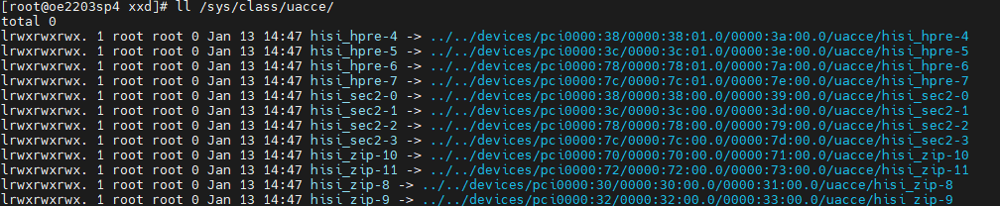
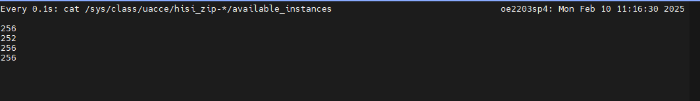

# VM Huge-Page Memory Configuration Reduction Feature Guide

## Feature Description

### Overview

This document describes how to deploy and use the VM huge-page memory configuration reduction feature on a Kunpeng server.

The memory price in the current market keeps increasing. To reduce the VM memory overhead and improve the physical memory utilization, technical measures need to be taken to optimize the memory configuration. This feature uses the ZRAM module to compress and store the cold-page memory of VMs, and uses the Kunpeng Accelerator Engine (KAE) to improve the compression efficiency. In addition, this feature allows huge-page memory to be swappable. This implements efficient utilization of memory resources, so that more VMs can be deployed with limited physical memory.

### Function Architecture

The VM huge-page memory configuration reduction feature is implemented by the ZRAM module, KAE, kernel huge-page memory swap system, and huge-page memory management tool.

| Module| Function|
|--|--|
| ZRAM module| Provides the huge-page memory swap backend to compress and store the swapped cold-page memory to save physical memory.|
| KAE| Provides hardware-level acceleration for ZRAM compression and decompression operations to improve the compression efficiency and reduce the CPU usage.|
| Huge-page memory management tool| Implements cold and hot tiering for user-space huge-page memory and proactive swap.|
| Kernel huge-page memory swap system| Allows huge-page memory to be swappable.|

## Environment Requirements

Before enabling this feature, ensure that the hardware and software environments meet the requirements.

**Hardware Requirements**

| Item| Description|
|--|--|
| Processor| New Kunpeng 920 processor model|

**Software Requirements**

| Item| Version or Description|
|--|--|
| OS | openEuler 24.03 SP3|
| Kernel source code baseline| OLK-6.6 6.6.0-132.0.0|
| libvirt | 9.10.0 (Yum repository)|
| QEMU| 8.2.0 (Yum repository)|
| Redis| 6.2.0 (You can install any version by yourself. This document uses 6.2.0 as an example.)|
| Nginx| 1.24.0 (You can install any version by yourself. This document uses 1.24.0 as an example.)|
| wrk | 4.1.0 (You can install any version by yourself. This document uses 4.1.0 as an example.)|  

## Software Compilation

### Configuring the Compilation Environment

Install the compilation dependencies.

```bash
yum -y install rpm-build openssl-devel bc rsync gcc gcc-c++ flex bison m4 git glib2-devel spice-protocol zlib-devel libffi-devel libgcrypt-devel libnfs-devel libiscsi-devel libseccomp-devel libaio-devel libcap-ng-devel librados2-devel librbd1-devel libfdt-devel libpng-devel spice-server-devel numactl-devel dwarves elfutils-libelf-devel ncurses-devel cmake make liburing-devel ninja-build autoconf automake libtool patch libvirt-devel libboundscheck
```

### Obtaining the Kernel Source Code and Patches

1. Obtain the kernel source code.

    ```bash
    cd /home/
    git clone https://gitcode.com/openeuler/kernel.git
    cd kernel
    git checkout ce07ff4681bc4d83315681ae78e0b7ef1a5bd315
    ```

2. Obtain the patch files that allow the huge-page memory to support the reclaim function and ZRAM to support KAE.

    ```bash
    cd /home/
    git clone https://gitcode.com/boostkit/cloud-virtual.git
    ```

3. Apply the kernel patches.

    ```bash
    cd /home/kernel
    git apply /home/cloud-virtual/kernel/kernel-6.6.0/hugepage-reclaim/[zram]0001-zram-switch-to-async-acomp-and-mutex.patch
    git apply /home/cloud-virtual/kernel/kernel-6.6.0/hugepage-reclaim/[hugepage-reclaim]0001-mm-hugetlb-preparatory-cleanups-for-HugeTLB-swap-sup.patch
    git apply /home/cloud-virtual/kernel/kernel-6.6.0/hugepage-reclaim/[hugepage-reclaim]0002-mm-hugetlb-add-HugeTLB-anonymous-page-swap-support.patch
    git apply /home/cloud-virtual/kernel/kernel-6.6.0/hugepage-reclaim/[hugepage-reclaim]0003-fs-hugetlbfs-add-file-backed-HugeTLB-page-swap-and-s.patch
    git apply /home/cloud-virtual/kernel/kernel-6.6.0/hugepage-reclaim/[hugepage-reclaim]0004-mm-hugetlb-add-fault-time-reclaim-inactive-list-and-.patch
    ```

### Compiling and Installing the Kernel

1. Prepare for `config` compilation.

    ```bash
    cd /home/kernel
    cp /boot/config-6.6.0-132.0.0.111.oe2403sp3.aarch64 .config
    vim .config
    # Delete TRUSTED_KEYS.
    CONFIG_SYSTEM_TRUSTED_KEYS=""
    ```

2. Generate the compilation configuration.

    ```bash
    make menuconfig
    ```

    After the configuration window is displayed, exit directly.

3. Compile the kernel and pack the RPM packages.

    ```bash
    make rpm-pkg -j $(nproc)
    ```

4. Install the new kernel. (Replace the RPM package paths with the actual ones.)

    ```bash
    rpm -ivh /root/rpmbuild/RPMS/aarch64/kernel-6.6.0+-1.aarch64.rpm --force
    rpm -ivh /root/rpmbuild/RPMS/aarch64/kernel-devel-6.6.0+-1.aarch64.rpm --force
    ```

5. Add the huge-page memory parameters to the `/etc/grub2-efi.cfg` file. Adjust the number of huge pages based on the actual environment.

    ```text
    "default_hugepagesz=2M hugepagesz=2M hugepages=131072 hugetlb_swap=on"
    ```

6. Restart the physical machine, replace the kernel, and make the configuration take effect.

    ```bash
    reboot
    ```

### Compiling and Installing KAE

1. Obtain the KAE source code.

    ```bash
    cd /home/
    git clone https://gitcode.com/boostkit/KAE.git -b kae2
    cd KAE
    ```

2. Compile and install KAE.

    ```bash
    sh build.sh all
    ```

3. Run the following command to check whether the KAE installation is successful:

    ```bash
    ll /sys/class/uacce/
    ```

    

### Obtaining the memlink Tool

1. Obtain the memlink source code.

    ```bash
    cd /home/
    git clone https://gitcode.com/openeuler/memlinkd.git
    ```

2. Compile the source code.

    ```bash
    cd memlinkd
    yum-builddep memlinkd.spec
    tar jcvf memlinkd.tar.bz2 --exclude=.git src
    mkdir -p /root/rpmbuild/SOURCES/
    cp memlinkd.tar.bz2 /root/rpmbuild/SOURCES/
    rpmbuild -ba memlinkd.spec
    ```

3. Install the memlink SDK.

    ```bash
    cd /root/rpmbuild/RPMS/aarch64/;rpm -ivh memlinkd-*
    ```

### Obtaining the Huge-Page Memory Management Tool

This tool is used only for function demonstration. It provides the methods of using the cold and hot huge-page memory tiering and proactive swap functions, and basic memory management policies. You are not advised to use this tool in the production environment. You can customize the configuration based on the actual application scenario by referring to this tool.

1. Obtain the reclaim source code.

    ```bash
    git clone https://gitcode.com/boostkit/cloud-virtual.git
    ```

2. Compile the source code.

    ```bash
    cd cloud-virtual/tools/
    gcc *reclaim.c -o reclaim  $(pkg-config --cflags --libs glib-2.0) -lvirt -lnuma -lmemlink_sdk -lboundscheck
    ```

## Software Installation

### Installing Host Software

Install the software packages related to libvirt and QEMU.

    ```bash
    yum install -y libvirt qemu edk2-aarch64
    ```

### Installing VM Software

Install the software packages related to Redis, Nginx, and wrk.

    ```bash
    yum install -y redis nginx wrk
    ```

## Feature Usage

### Configuring the Number of Huge Pages

During the test, you can dynamically adjust the number of huge pages on each NUMA node as required. For example, you can change the number of huge pages on node 0 to 10000.

    ```bash
    echo 10000 > /sys/devices/system/node/node0/hugepages/hugepages-2048kB/nr_hugepages
    ```

### Configuring the VM

1. Edit the VM XML configuration file to add support for huge-page memory, enable the huge-page pod option for dynamic huge-page allocation, and bind the VM to cores/memory. (Configure core and memory binding based on the actual situation.)

    |Tag Name|Description|
    |--|--|
    |hugepages|Adds support for huge-page memory.|
    |hugepage-ondemand|Enables the huge-page pod option for dynamic huge-page allocation. If this option is not configured, it is disabled by default.|
    |cputune|Binds the VM to cores.|
    |numatune|Binds the VM to memory.|

    ```xml
    <memoryBacking>
      <hugepages>
        <page size='2048' unit='KiB'/>
      </hugepages>
      <allocation mode='hugepage-ondemand'/>
    </memoryBacking>
    <cputune>
      <vcpupin vcpu='0' cpuset='10'/>
      <vcpupin vcpu='1' cpuset='11'/>
      <emulatorpin cpuset='10-11'/>
    </cputune>
    <numatune>
      <memnode cellid='0' mode='strict' nodeset='0'/>
    </numatune>
    <cpu mode="host-passthrough" check="none">
      <numa>
        <cell id='0' cpus='0-1' memory='8388608' unit='KiB' memAccess='shared'/>
      </numa>
    </cpu>
    ```

2. Edit the VM XML configuration file to configure the memory reclamation policy tag for the VM. This tag must be configured for all VMs. The tag content is used to determine whether memory reclamation is allowed.
Note: The reclamation tag is a user-defined metadata tag. The example provided in this document is for reference only. You can customize the tag name as needed and use it together with the huge-page memory reclamation tool.

- **Enabling memory reclamation** (recommended):

    ```xml
    <metadata>
      <reclaim xmlns="http://reclaim.io"/>
    </metadata>
    ```

- **Disabling memory reclamation**:

    ```xml
    <metadata>
      <no_reclaim xmlns="http://reclaim.io"/>
    </metadata>
    ```

### Starting the memlink Tool

1. Modify the memlink configuration, including the following configuration items.

    ```bash
    vim /etc/memlinkd.conf
    ```

    ```text
    page_score_enable=1
    page_score_poll_cycle_sec=5
    ```

2. Start the memlink tool.

    ```bash
    modprobe etmem_scan
    systemctl start memlinkd
    ```

### Enabling KAE Acceleration

1. Load the KAE kernel module.

    ```bash
    rmmod hisi_zip
    rmmod hisi_sec2
    rmmod hisi_hpre
    rmmod hisi_qm
    rmmod uacce
    modprobe hisi_zip uacce_mode=2 perf_mode=1 pf_q_num=256
    ```

2. Check whether KAE acceleration has taken effect.
Run the following command to check whether KAE queues exist and whether the number of queues is the same as the configured number:

    ```bash
    watch -n 1 "cat /sys/class/uacce/hisi_zip-*/available_instances"
    ```

    

### Configuring ZRAM and the Swap Interface

```bash
modprobe etmem_swap
```

Note: The size of the ZRAM block device should be configured based on the actual huge-page memory size. You are advised to set it to 40% of the total huge-page memory size of the server. Strictly follow the instructions in this document to configure ZRAM. Configuring writeback devices and secondary compression algorithms is not supported.

```bash
modprobe zram
echo deflate > /sys/block/zram0/comp_algorithm
echo 32G > /sys/block/zram0/disksize
mkswap /dev/zram0
swapon -p 100 /dev/zram0
```

After the configuration is complete, check whether the number of KAE queues changes. If the number of queues decreases compared with that before the configuration, KAE acceleration has taken effect.

```bash
watch -n 1 "cat /sys/class/uacce/hisi_zip-*/available_instances"
```

### Starting the Huge-Page Memory Management Tool

```bash
./reclaim
```

## VM Startup for Tests

### Single-VM Overcommitment Test

This test is used only for reliability testing. The following uses a VM with 8 vCPUs and 32 GB as an example. The number of huge pages is set to 12288 (24 GB). (If the VM uses huge-page applications such as DPDK and SPDK, reserve huge pages for the applications when configuring the number of huge pages. Currently, the memory allocation for DPDK and SPDK applications is not controlled, and huge pages may be directly allocated across NUMA nodes.)

1. Set the number of huge pages to 12288 (24 GB).

    ```bash
    echo 12288 > /sys/devices/system/node/node0/hugepages/hugepages-2048kB/nr_hugepages
    ```

2. Start the VM.

    ```bash
    virsh start vm_name
    ```

3. Start the Redis or Nginx service on the VM.

    ```bash
    systemctl start redis
    ```

    Or

    ```bash
    systemctl start nginx
    ```

4. Run the following command on the physical machine to check the number of remaining huge pages:

    ```bash
    watch -n 1 "cat /sys/devices/system/node/node0/hugepages/hugepages-2048kB/free_hugepages"
    ```

5. Start the stress test tool on the client to perform a stress test on the Redis or Nginx service.

    ```bash
    redis-benchmark -h <VM_IP_address> -p 6379 -t set -c 1000 -r 10000000 -n 10000000 -d 1024
    ```

    Or

    ```bash
    wrk -H "Connection: Close" -t 10 -c 8000 -d 60s http://<VM_IP_address>:<Port_number>/index.html
    ```

6. Record the stress test result. Compared with scenarios without memory overcommitment, the stress test performance decreases by less than 15% when the number of remaining huge pages is greater than 10% of the total huge pages.

7. Check whether the huge-page memory swap is triggered when the number of remaining huge pages is less than 20% of the total huge pages. You can use either of the following methods. In addition, pay attention to the logs of the reclaim tool.

    ```bash
    watch -n 1 "swapon --show"
    ```

    

    ```bash
    watch -n 1 "cat /proc/meminfo | grep Huge"
    ```

    

8. After the memory usage of the VM exceeds 24 GB and the number of remaining huge pages on the physical machine decreases to 0, check whether the VM runs properly. If it runs properly, continue the stress test and check whether the memory usage of the VM keeps increasing. In this case, the VM performance is not guaranteed.

### Multi-VM Overcommitment Test

The following uses a single NUMA node with 60 GB huge pages as an example. The number of huge pages for a single NUMA node is set to 30720 (60 GB), and three VMs are started with memory specifications of 16 GB, 32 GB, and 32 GB, respectively.

1. Set the number of huge pages to 30720 (60 GB).

    ```bash
    echo 30720 > /sys/devices/system/node/node0/hugepages/hugepages-2048kB/nr_hugepages
    ```

2. Start the VMs.

    ```bash
    virsh start vm_name1
    virsh start vm_name2
    virsh start vm_name3
    ```

3. Start the Redis or Nginx service on each VM.

    ```bash
    systemctl start redis
    ```

    Or

    ```bash
    systemctl start nginx
    ```

4. Run the following command on the physical machine to check the number of remaining huge pages:

    ```bash
    watch -n 1 "cat /sys/devices/system/node/node0/hugepages/hugepages-2048kB/free_hugepages"
    ```

5. Start the stress test tool on the client to perform a stress test on the Redis or Nginx service.

    ```bash
    redis-benchmark -h <VM_IP_address> -p 6379 -t set -c 1000 -r 10000000 -n 10000000 -d 1024
    ```

    Or

    ```bash
    wrk -H "Connection: Close" -t 10 -c 8000 -d 60s http://<VM_IP_address>:<Port_number>/index.html
    ```

6. Record the stress test result. Compared with scenarios without memory overcommitment, the stress test performance decreases by less than 15% when the number of remaining huge pages is greater than 10% of the total huge pages.

7. Check whether the huge-page memory swap is triggered when the number of remaining huge pages is less than 20% of the total huge pages. You can use either of the following methods. In addition, pay attention to the logs of the reclaim tool.

    ```bash
    watch -n 1 "swapon --show"
    ```

    ```bash
    watch -n 1 "cat /proc/meminfo | grep Huge"
    ```

8. After the memory usage of the VMs exceeds 64 GB and the number of remaining huge pages on the physical machine decreases to 0, check whether the VMs run properly. If they run properly, continue the stress test and check whether the memory usage of the VMs keeps increasing. In this case, the VM performance is not guaranteed.

9. You are advised to select VMs with low pressure for live migration when the number of remaining huge pages is less than 10% of the total huge pages, so that huge pages can be released to VMs with high pressure. In actual use, you can adjust the migration threshold based on the scenario and requirements to avoid the out of memory (OOM) situation. In any scenario, if the physical machine is in the OOM state, the VM performance cannot be ensured.
