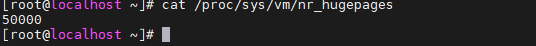

# 鲲鹏虚拟化损耗调优指南

## 概述<a name="ZH-CN_TOPIC_0000002518251754"></a>

本文针对基于KVM的虚拟化场景，指导用户对鲲鹏服务器的虚拟化相关参数进行调整，减少虚拟化使用场景相比物理机使用场景的性能损耗。

在基于KVM的虚拟化场景中，尽管KVM通过利用硬件虚拟化技术显著降低了虚拟化开销，但在高负载场景下，虚拟机仍可能面临由VM-Exit事件、内存虚拟化开销以及I/O虚拟化瓶颈等所引发的性能损耗。这些损耗可能导致虚拟机与物理机之间的性能差距依然显著。对于承载关键业务的虚拟机，过高的虚拟化损耗可能导致资源利用率下降、延迟增加、吞吐量受限，甚至无法满足业务性能要求。因此，本文将提供针对虚拟化网络和存储应用的调优指南，以帮助优化虚拟化环境中的性能表现。


## 环境要求<a name="ZH-CN_TOPIC_0000002549771521"></a>

描述被调优的服务器的硬件要求和软件要求。

鲲鹏虚拟化损耗调优面向的虚拟机规格为4U8G、32U64G。

**硬件要求<a name="section1815816277716"></a>**

硬件要求如[**表 1** 硬件要求](#硬件要求)所示。

**表 1** 硬件要求<a id="硬件要求"></a>

|项目|物理机配置|
|--|--|
|服务器|鲲鹏服务器|
|处理器|2*鲲鹏920新型号处理器|
|内存|内存按1DPC方式配置将获得最佳性能，即将DIMM0插满。|


**软件要求<a name="section102619448716"></a>**

软件要求如[**表 2** 软件要求](#软件要求)所示。

**表 2** 软件要求<a id="软件要求"></a>

|项目|软件版本|获取方式|
|--|--|--|
|操作系统|openEuler 24.03 LTS SP1|物理机ISO镜像：[获取链接](https://repo.openeuler.org/openEuler-24.03-LTS-SP1/ISO/aarch64/openEuler-24.03-LTS-SP1-everything-aarch64-dvd.iso)<br>虚拟机qcow2镜像：[获取链接](https://repo.openeuler.org/openEuler-24.03-LTS-SP1/virtual_machine_img/aarch64/openEuler-24.03-LTS-SP1-aarch64.qcow2.xz)|
|libvirt|9.10.0|通过配置Yum源安装|
|QEMU|8.2.0|通过配置Yum源安装|
|iperf3|3.16-3.oe2403sp1|通过配置Yum源安装|
|qperf|0.4.11-1.oe2403sp1|通过配置Yum源安装|
|FIO|3.34|通过配置Yum源安装|


## 网络损耗调优<a name="ZH-CN_TOPIC_0000002518251758"></a>

### 设置虚拟机运行位置<a name="ZH-CN_TOPIC_0000002518411674"></a>

虚拟机运行在网卡所在NUMA节点，能够减少跨节点内存访问和资源争用，显著降低网络I/O延迟并提升吞吐量。

NUMA架构下，每个CPU节点（NUMA Node）的本地内存访问速度远快于远程节点。若虚拟机的vCPU和内存分配在网卡所属的NUMA节点，虚拟机与网卡之间的数据传输（如网络包处理）可直接通过本地内存完成，避免了跨节点访问的额外延迟和带宽损耗。

```
cat /sys/class/net/网卡名/device/numa_node
```

此处为示例，执行上述命令查询网卡enp65s0f0np0。可见其所在NUMA节点为0。因此，虚拟机的vCPU应该绑定在NUMA 0节点上的物理CPU核心。


### 开启内存大页<a name="ZH-CN_TOPIC_0000002518411670" id="开启内存大页"></a>

开启内存大页减少内存访问的页表层级和TLB未命中次数，显著降低网络协议栈处理数据时的内存管理开销，从而提升网络吞吐量并降低延迟。

1. 修改cmdline启动参数。以下开启内存大页的方式为永久开启，是在启动参数中添加目标大页大小与数量。
    1. 打开grub2-efi.cfg文件。

        ```
        vim /etc/grub2-efi.cfg
        ```

    2. 按“i”进入编辑模式，在cmdline中增加“default\_hugepagesz=2M hugepagesz=2M  hugepages=50000”。如下图所示，默认大页大小为2M，数量为50000。

        

    3. 按“Esc”键退出编辑模式，输入 **:wq!**，按“Enter”键保存并退出文件。
    4. 使用**reboot**命令重启服务器。

2. 确认内存大页配置情况。

    ```
    cat /proc/sys/vm/nr_hugepages
    ```

    

3. 虚拟机xml中配置内存大页。

    ```
    virsh edit 虚拟机名称
    ```

    如下所示，在page size中指定大小，即是虚拟机启用的内存大页大小。

    ```
    <domain type = 'KVM'>
    ...
      <memoryBacking>
        <hugepages>
          <page size='2048' unit='KiB'/>
        </hugepages>
      </memoryBacking>
    ...
    <domain>
    ```


### 开启GICv4.1<a name="ZH-CN_TOPIC_0000002549891511" id="开启GICv4.1"></a>

GICv4.1中引入诸如直通设备vLPI中断透传、vSGI中断直通等中断直接注入特性，能够显著减少虚拟机在高负载环境中的VM-exit与VM-entry，提升虚拟机的性能。

1. 修改BIOS。

    在“BIOS \> Advanced \> Processor Configuration”中，将GIC Version设置为4.1，如下图所示。

    

2. 修改cmdline启动参数。

    在cmdline中增加“kvm-arm.vgic\_v4\_enable=1”。修改完cmdline后，需要重启服务器。

    

3. 确认GICv4.1成功开启。

    Host执行**dmesg | grep GIC**，可以观察到kvm \[1\]: GICv4.1 support enabled，说明GICv4.1已经使能。

    

> **说明：** 
>在使用4U8G规格虚拟机测试网络带宽时，由于虚拟机vCPU核数较少，网络中断与业务会同时运行在四个vCPU中。为了控制变量，需要测试物理机四个CPU核心的网络带宽时，同样将网络中断与业务运行在四个CPU核心中。


### OVS+DPDK优化<a name="ZH-CN_TOPIC_0000002549771523"></a>

Virtio+OVS+DPDK组网模式是一种常用的高性能虚拟化网络解决方案。在该架构中，前端Virtio驱动通过共享内存（Virtqueue）与OVS-DPDK通信，而OVS-DPDK是在用户态处理数据包并通过Poll Mode Driver \(PMD\) 发送到物理网卡，实现高速转发，适用于网络性能要求较高的云原生和虚拟化场景。在该场景下可根据实际需要，使能以下两种优化手段。

#### PMD负载均衡<a name="ZH-CN_TOPIC_0000002549891515"></a>

PMD负载均衡通过OVS侧自动统计每个PMD轮询核上的任务负载，计算不同PMD轮询核上所处理任务的压力，从而进行重新均分任务到不同的PMD轮询核，依次降低PMD轮询核上的单核负载压力，避免PMD轮询核造成的性能瓶颈，从而提升整体虚拟化栈的性能。

1. 判断是否需要使能PMD负载均衡优化。

    ```
    ovs-appctl dpif-netdev/pmd-rxq-show -secs 5
    ```

    > **说明：** 
    >若观测到单个PMD多个pmd usage加上overhead的整体利用率超过70%时，则建议使能该优化。

2. 执行如下命令配置OVS PMD负载均衡。

    ```
    ovs-vsctl --no-wait set Open_vSwitch . \
    other_config:pmd-auto-lb="true" \
    other_config:pmd-auto-lb-improvement-threshold="25" \
    other_config:pmd-auto-lb-load-threshold="70" \
    other_config:pmd-auto-lb-rebal-interval="1"
    ```

    > **说明：** 
    >other\_config:pmd-auto-lb="true"：表示开启自动均衡。
    >other\_config:pmd-auto-lb-improvement-threshold="25"：表示负载方差改进25%即重均衡。
    >other\_config:pmd-auto-lb-load-threshold="70"：表示PMD负载达到70%可以启动均衡。
    >other\_config:pmd-auto-lb-rebal-interval="1"：设置自动均衡周期为1min。


#### OVS队列选择策略优化<a name="ZH-CN_TOPIC_0000002518411672"></a>

当虚拟机是多队列的场景下，虚拟机qperf时延工具运行所在的CPU可能和virtio-net input中断的CPU不在同一个上面，此时虚拟机会涉及IPI中断陷出，从而增加了时延开销。所以对于时延敏感型场景，可以更改OVS侧发包队列的选择逻辑，新增发送模式，当PMD接收到来自虚拟机的网络包时，记录其五元组信息以及队列ID。下次往虚拟机发送包时，根据对应五元组信息匹配到对应的队列ID，这样就可以尽可能的减少虚拟机IPI陷出的情况，减少网络收发包的时延。

1. 下载DPDK 24.11源码。

    ```
    git clone https://github.com/DPDK/dpdk.git -b v24.11
    ```

    在DPDK 24.11源码目录的上级目录下载OVS 3.5源码。

    ```
    git clone https://github.com/openvswitch/ovs.git -b v3.5.0
    ```

2. 在DPDK 24.11源码目录的上级目录下载OVS队列选择优化补丁。

    ```
    git clone https://gitee.com/kunpeng_compute/boostkit_-virtualization.git
    ```

3. 将补丁打入OVS源码。以下命令在OVS源码的根目录下执行。

    ```
    git am --reject ../boostkit_-virtualization/dpdk/dpdk-24.11/\[Virtualization_Loss_Optimization\]0001-Adding-a-new-transmission-mode-TXQ_REQ.patch
    ```

4. 编译DPDK。以下命令在DPDK源码的根目录下执行。

    ```
    meson --prefix=/usr --libdir=/usr/lib64 --bindir=/usr/bin --sbindir=/usr/sbin --includedir=/usr/include/dpdk build 
    ninja -C build
    ninja -C build install
    ldconfig
    ```

    编译OVS。以下命令在OVS源码的根目录下执行。

    ```
    ./boot.sh
    ./configure --prefix=/usr --sysconfdir=/etc --localstatedir=/var --libdir=/lib64 --enable-ssl --enable-shared --with-dpdk=shared
    make -j`nproc`
    make -j`nproc` install
    ```

5. 开启OVS队列选择优化。

    ```
    ovs-vsctl set Interface tap0 other_config:tx-steering=txfollowrx
    ```

    > **说明：** 
    >如需关闭使用命令：
    >```
    >ovs-vsctl remove Interface tap0 other_config tx-steering
    >```


## 存储损耗调优<a name="ZH-CN_TOPIC_0000002549771525"></a>

本小节将讲述如何通过设置内存大页、开启GICv4.1等方式降低存储虚拟化损耗。

在虚拟化存储应用中，基础调优同样需要配置内存大页和开启GICv4.1降低虚拟化损耗。配置内存大页请参考[开启内存大页](#开启内存大页)，开启GICv4.1请参考[开启GICv4.1](#开启GICv4.1)。

### SPDK中断聚合优化<a name="ZH-CN_TOPIC_0000002549891513"></a>

Virtio+SPDK通过SPDK绕过传统内核存储栈，通过用户态驱动 + 共享内存的方式实现了一套低延迟、高吞吐的虚拟化存储 I/O 加速方案。针对前端中断占比较高的场景，提出SPDK中断聚合优化，采用virtio前后端感知的中断聚合技术，通过感知前后端IO请求、IO完成请求数，减少后端对前端的中断通知数量，释放CPU算力给前端IO请求下发以及前端的IO数据读取，提升系统整体的吞吐性能。

1. 下载SPDK 24.01源码。

    ```
    mkdir SPDK_24.01
    cd SPDK_24.01
    git clone https://github.com/spdk/spdk -b v24.01.x
    ```

2. 下载SPDK补丁。

    ```
    git clone https://gitee.com/src-openeuler/spdk.git
    cd spdk
    git checkout -b 2403SP2_SPDK origin/openEuler-24.03-LTS-SP2
    cp 0013-vhost-add-vhost-interrupt-coalescing.patch ../SPDK_24.01/spdk
    ```

    合入补丁。

    ```
    git am --reject 0013-vhost-add-vhost-interrupt-coalescing.patch
    ```

3. 安装依赖。

    ```
    yum install fuse3-devel
    ```

4. 编译使用新的SPDK。

    ```
    cd ../SPDK_24.01/spdk
    git submodule update --init
    ./configure  --disable-tests --disable-unit-tests  --enable-lto --disable-debug
    make -j`nproc` 
    make -j`nproc` install 
    ln -s `pwd`/build/bin/vhost /usr/bin/vhost 
    ln -s `pwd`/scripts/rpc.py /usr/bin/rpc 
    ```

5. 开启SPDK中断聚合。

    ```
    vhost -S /var/tmp -m [4,6,8,10] -E &
    rpc bdev_aio_create /dev/nvme1n1 aio_0 512
    rpc vhost_create_blk_controller vhost.0 aio_0
    ```

    > **说明：** 
    >其中“-E”参数为新增的中断聚合使能开关。
    >\[4,6,8,10\]为SPDK绑定的4个轮询核。


## 缩略语<a name="ZH-CN_TOPIC_0000002549771527"></a>

|**缩略语**|**英文全称**|**中文全称**|
|--|--|--|
|NUMA|Non-Uniform Memory Access|非一致性内存访问|
|KVM|Kernel-based Virtual Machine|基于内核的虚拟机|
|DIMM|Dual Inline Memory Module|双列直插内存模块|
|DIMM0|Dual Inline Memory Module slot 0|计算机主板上的第一个内存插槽|
|TLB|Translation Lookaside Buffer|地址转换后备缓冲器|
|GIC|Generic Interrupt Controller|通用中断控制器|
|LPI|Local Peripheral Interrupt|本地外设中断|
|SGI|Software Generated Interrupt|软件生成的中断|


