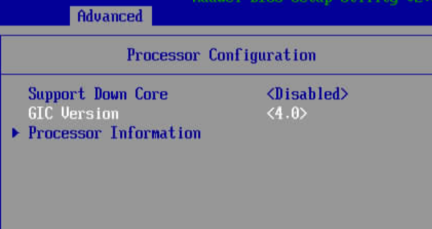
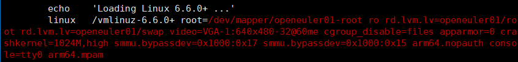
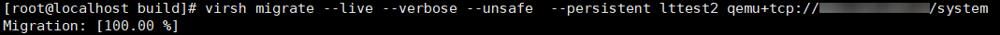
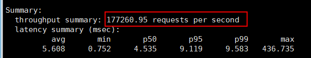
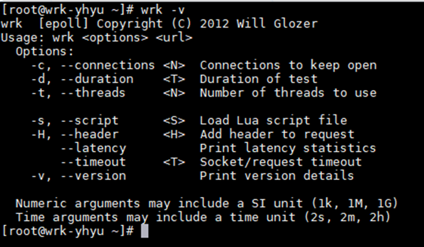
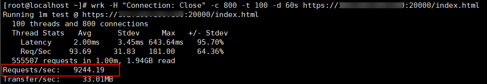
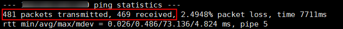
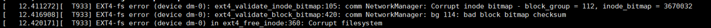
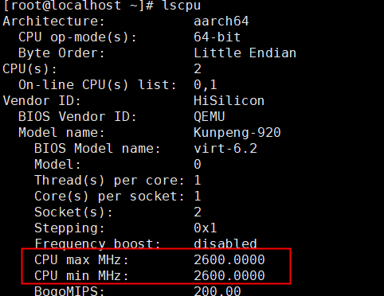

# 鲲鹏920跨代热迁移 用户指南<a name="ZH-CN_TOPIC_0000002521252894"></a>

## 特性描述<a name="ZH-CN_TOPIC_0000002549771341"></a>

### 简介<a name="ZH-CN_TOPIC_0000002549891359"></a>

本文主要介绍如何在使用openEuler操作系统的鲲鹏服务器上，执行由鲲鹏920服务器向鲲鹏920新型号服务器的虚拟机单向跨代热迁移。

虚拟机热迁移（Live Migration）是一种在不中断虚拟机运行的情况下，将虚拟机从一个物理主机迁移到另一个物理主机的技术。跨代热迁移技术的核心优势是支持在不同代的硬件之间迁移虚拟机，从而在硬件升级迭代过程中不影响虚拟机的运行状态和业务连续性。在实践中，跨代热迁移通常要求目标和源硬件支持一定程度的兼容性，同时虚拟机的操作系统和应用也需要能够容忍一定的硬件差异。因此，尽管技术上较为复杂，但它为数据中心和云服务提供了更强的灵活性和业务不中断的保障。


### 其他信息<a name="ZH-CN_TOPIC_0000002518251592"></a>

在配置特性前，请先了解虚拟机热迁移使用约束与限制和应用场景。

**规格<a name="section186211624175715"></a>**

可支持虚拟机规格包括但不限于2C8G、4C8G、4C16G、8C16G、16C32G、32C64G。

**版本支持<a name="section1625164615574"></a>**

- 版本：仅支持Kernel 6.6.0和QEMU 8.2.0。
- License支持：无。

**约束与限制<a name="section3897196125818"></a>**

使用环境需满足软硬件环境要求。

**应用场景<a name="section49961711506"></a>**

虚拟机热迁移的应用场景主要包括负载均衡、硬件维护和容灾高可用，通过动态调整虚拟机分布避免单台物理主机过载并提升资源利用率，在不中断服务的情况下迁移虚拟机以便对原主机进行维护或升级，以及在主机故障或性能下降时快速迁移虚拟机以保证业务连续性。


## 安装和使用<a name="ZH-CN_TOPIC_0000002549771343"></a>

### 环境要求<a name="ZH-CN_TOPIC_0000002549891357"></a>

本文基于openEuler操作系统提供指导，在正式操作前请确保软硬件均满足要求。

**硬件要求<a name="section26241127"></a>**

硬件要求如[**表 1** 硬件要求](#硬件要求) 所示。

**表 1** 硬件要求<a id="硬件要求"></a>

|项目|说明|
|--|--|
|源端处理器|鲲鹏920处理器|
|目的端处理器|鲲鹏920新型号处理器|


**iBMC和BIOS版本要求<a name="section4793193042413"></a>**

iBMC和BIOS版本要求如[**表 2** iBMC和BIOS版本要求](#iBMC和BIOS版本要求) 所示。

**表 2** iBMC和BIOS版本要求<a id="iBMC和BIOS版本要求"></a>

|项目|版本|
|--|--|
|源端iBMC|V3.03及以上|
|源端BIOS|V5.29及以上|
|目的端iBMC|V5.0及以上|
|目的端BIOS|V20.0及以上|


**操作系统和软件要求<a name="section153345522323"></a>**

操作系统和软件要求如[**表 3** 操作系统和软件要求](#操作系统和软件要求) 所示。

**表 3** 操作系统和软件要求<a id="操作系统和软件要求"></a>

|项目|版本|获取方法|
|--|--|--|
|OS|openEuler 24.03 LTS SP1|获取链接|
|内核|6.6.0-72|源码：获取链接补丁：获取链接|
|Libvirt|9.10.0|yum源安装|
|QEMU|8.2.0|源码：获取链接补丁：获取链接|
|Redis|6.2.7|yum源安装|
|Nginx|1.24.0|yum源安装|
|Perf|6.6.0-89.0.0.94|yum源安装|

### 配置BIOS<a name="ZH-CN_TOPIC_0000002518411504"></a>

#### 配置源端BIOS<a name="ZH-CN_TOPIC_0000002549771345"></a>

为了保持迁移源端服务器与目的端服务器在SSBS特性上的一致性，需要将源端BIOS与固件升级到本文档要求的版本，并且修改源端鲲鹏920服务器BIOS选项，打开SSBS。

1. 重启源端物理机，并进入BIOS界面。
2. 设置“Advanced \> Performance Config \> SSBS Support”下的“SSBS Support”为“Enabled”。

    


#### 配置目的端BIOS<a name="ZH-CN_TOPIC_0000002518411502"></a>

由于鲲鹏920服务器不支持GIC4.1版本，且系统时钟频率只支持100MHz，需要修改目的端鲲鹏920新型号服务器BIOS选项。

1. 重启目的端物理机，并进入BIOS界面。
2. 设置“Advanced \> Processor Configuration \> GIC Version”下的“GIC Version”为“4.0”。

    

3. 设置“Advanced \> MISC Configuration \> SysCount Frequency”下的“SysCount Frequency”为“100MHz”。

    


### 编译安装服务器内核<a name="ZH-CN_TOPIC_0000002518251594"></a>

源端鲲鹏920服务器与目的端鲲鹏920新型号服务器均安装openEuler 24.03 LTS SP1系统，并且在openEuler 24.03 LTS SP1系统的基础上编译安装定制6.6内核。

> **须知：** 
>-   因特性安装过程涉及到系统文件的修改，安装过程中的各操作默认由**root**用户执行，非**root**用户下进行相关操作应自行确保具有相关权限。
>-   编译安装内核步骤中涉及到的路径与文件名需根据实际情况修改。
>-   需要提前配置好yum源。

1. 安装内核编译需要的相关依赖包。

    ```
    yum -y install rpm-build openssl-devel bc rsync gcc gcc-c++ flex bison m4 git glib2-devel spice-protocol zlib-devel libffi-devel libgcrypt-devel libnfs-devel libiscsi-devel libseccomp-devel libaio-devel libcap-ng-devel librados2-devel librbd1-devel libfdt-devel libpng-devel spice-server-devel numactl-devel dwarves elfutils-libelf-devel ncurses-devel cmake make liburing-devel ninja-build
    ```

2. 获取开源版本内核源码并进入tag6.6.0-72.0.0。

    ```
    cd /home
    git clone https://gitee.com/openeuler/kernel.git
    cd kernel
    git checkout 6.6.0-72.0.0
    git switch --detach 5f2e69404ccc6b0a60f370b25310213b19b657c1
    ```

3. 获取内核补丁并将补丁文件应用至开源版本代码。

    ```
    cd /home
    git clone https://gitee.com/kunpeng_compute/boostkit_-virtualization.git
    cp /home/boostkit_-virtualization/tools/[live-migration]apply_patches.py /home/kernel/
    cd /home/kernel
    python3 [live-migration]apply_patches.py /home/boostkit_-virtualization/kernel/kernel-6.6.0
    ```

4. 复制当前系统配置文件作为编译配置文件，并做如下修改。

    ```
    cp /boot/config-6.6.0-72.0.0.76.oe2403sp1.aarch64 .config
    vim .config
    CONFIG_SYSTEM_TRUSTED_KEYS=""
    ```

5. 生成编译配置，执行成功后直接exit。

    ```
    make menuconfig
    ```

6. 编译内核。

    ```
    make binrpm-pkg -j
    ```

7. 安装内核，更新引导文件。

    > **说明：** 
    >编译生成的RPM包所在的路径需要根据实际情况替换。

    ```
    rpm -ivh /root/rpmbuild/RPMS/aarch64/kernel-6.6.0-1.aarch64.rpm --force
    grub2-mkconfig -o /boot/efi/EFI/openEuler/grub.cfg
    ```

8. 修改内核启动参数。

    ```
    vi /boot/efi/EFI/openEuler/grub.cfg
    ```

    为新安装内核的启动参数增加如下内容：

    

    ```
    arm64.nopauth console=tty0 selinux=0 iommu.passthrough=1 pci=realloc
    ```

    设置新内核为默认启动内核，并检查是否设置成功：

    ```
    grub2-set-default "openEuler (6.6.0+) 24.03 (LTS-SP1)"
    grub2-editenv list
    ```

    

9. 重启系统并进入BMC切换到新的内核。

    ```
    reboot
    ```

### 编译安装QEMU<a name="ZH-CN_TOPIC_0000002518411500"></a>

源端鲲鹏920服务器与目的端鲲鹏920新型号服务器均需要编译安装定制的qemu 8.2.0。

1. 获取开源版本QEMU源码，并进入qemu-8.2.0分支。

    ```
    cd /home
    git clone https://gitee.com/openeuler/qemu.git
    cd qemu
    git switch qemu-8.2.0
    git switch --detach 5830dea26e69c47c9ec46d12662c24d1c4ac8436
    ```

2. 获取QEMU补丁并将补丁文件应用至开源版本代码。

    ```
    cd /home
    git clone https://gitee.com/kunpeng_compute/boostkit_-virtualization.git
    cp /home/boostkit_-virtualization/tools/[live-migration]apply_patches.py /home/qemu/
    cd /home/qemu
    python3 [live-migration]apply_patches.py /home/boostkit_-virtualization/qemu/qemu-8.2.0
    ```

3. 配置QEMU编译选项。

    ```
    mkdir build
    cd build
    ../configure --prefix=/usr/local/qemu-8.2.0 --disable-werror --enable-spice --enable-spice-protocol --target-list=aarch64-softmmu --cc="gcc" --extra-cflags="-Wno-error" --disable-docs --enable-virtfs --enable-numa --enable-kvm
    ```

4. 编译并安装QEMU，如出现编译失败的情况，参见文档末尾的注意事项。

    ```
    make -j && make install
    ```

### 安装Libvirt<a name="ZH-CN_TOPIC_0000002518251590"></a>

源端与目的端服务器均使用yum安装Libvirt即可。

```
yum -y install libvirt edk2-aarch64.noarch
```


### 修改系统与Libvirt配置<a name="ZH-CN_TOPIC_0000002518251596"></a>

**修改系统相关配置<a name="section4375102616228"></a>**

> **说明：** 
>-   请根据实际情况修改IP地址与主机名。
>-   进行配置修改操作前请先关闭迁移源端物理机与目的端物理机的安全防护措施。

1. 关闭源端与目的端物理机的SELinux特性，在“/etc/selinux/config”文件中做如下修改，并重启。

    ```
    SELINUX=disabled
    ```

2. 关闭目的端物理机防火墙。

    ```
    systemctl stop firewalld
    ```

3. 修改目的端物理机主机名。

    ```
    hostname target
    ```

4. 修改源端物理机“/etc/hosts”文件，添加目的端物理机IP地址与主机名，IP地址与迁移命令使用的IP保持一致。

    ```
    XXX.XXX.XXX.XXX target
    ```

**修改Libvirt相关配置<a name="section1807451083"></a>**

修改目的端物理机“/etc/libvirt/libvirtd.conf”相关配置，以允许Libvirt在虚拟机热迁移过程中监控虚拟机的状态。Libvirt将通过TCP协议在所有网络接口上侦听16509端口。

> **须知：** 
>以下配置通常用于开发和测试环境，或者对安全性要求不高的场景。如对安全性有更高要求，需要对侦听地址、身份验证、加密协议等做进一步的安全配置。

1. 修改目的端“/etc/libvirt/libvirtd.conf”相关配置，以允许Libvirt在虚拟机热迁移过程中监控虚拟机的状态。

    ```
    listen_tls = 0
    listen_tcp = 1
    tcp_port = "16509"
    listen_addr = "0.0.0.0"
    auth_tcp = "none"
    ```

2. 重启Libvirtd服务，启用侦听功能。

    ```
    systemctl stop libvirtd 
    systemctl enable --now libvirtd-tcp.socket
    systemctl daemon-reload
    systemctl restart libvirtd
    ```


### 搭建网桥<a name="ZH-CN_TOPIC_0000002549771347"></a>

鲲鹏920虚拟机跨代热迁移测试环境使用Linux网桥进行网络通信。

> **须知：** 
>-   源端与目的端物理机均需要配置网桥。
>-   若是源端物理机与目的端物理机网卡直连，则不需要配置网关。
>-   源端物理机与目的端物理机的网桥名需要一样。
>-   源端物理机与目的端物理机需处在同个网段。
>-   虚拟机的IP地址需要与网桥处在同个网段。

1. 创建网桥接口。

    ```
    brctl addbr <网桥名>
    ```

2. 绑定网卡。

    若是网卡存在IP地址，需要清除IP地址。

    ```
    ip addr flush dev <网卡名>
    ```

    执行以下命令，将网卡绑在网桥上。

    ```
    ip link set <网卡名> master <网桥名>
    ```

3. 启动接口。

    ```
    sudo ip link set <网桥名> up
    sudo ip link set <网卡名> up
    ```

4. 查看是否绑定成功。

    ```
    brctl show
    ```

    若绑定成功，回显如下：

    

    > **须知：** 
    >需要安装bridge-utils。

5. 配置网桥的IP地址与网关。

    ```
    ip addr add <IP地址> dev <网桥名>
    ip route add default via <网关IP地址> dev <网桥名>
    ```

6. 修改虚拟机XML绑定网桥。

    ```
    virsh edit <虚拟机名称>
    <interface type='bridge'>
      <mac address='<MAC地址>'/>
      <source bridge='<网桥名>'/>
      <model type='virtio'/>
      <address type='pci' domain='0x0000' bus='0x0b' slot='0x00' function='0x0'/>
    </interface>
    ```

    IP地址配置命令如下：

    ```
    ip addr add <IP地址> dev <虚拟网卡名>
    ```

7. 测试连通。

    在目标物理机中，执行以下命令查看虚拟机网络是否畅通，若能成功连接网络，则说明网络搭建成功。

    ```
    ping <虚拟网卡IP地址>
    ```

### 配置源端虚拟机xml<a name="ZH-CN_TOPIC_0000002549891363"></a>

虚拟机配置以4C8G为例，需要对源端虚拟机xml内容做如下修改。

1. 编辑源端虚拟机xml。

    ```
    virsh edit <虚拟机名称>
    ```

2. 指定虚拟机启动使用的qemu二进制文件路径。

    ```
    <emulator>/usr/local/qemu-8.2.0/bin/qemu-system-aarch64</emulator>
    ```

3. 修改QEMU启动参数，统一vCPU feature、PMU计数器数量、PMU统计事件类型以及Errata管理。

    ```
     <domain type='kvm' xmlns:qemu='http://libvirt.org/schemas/domain/qemu/1.0'>
       <qemu:commandline>
          <qemu:arg value='-cpu'/>
          <qemu:arg value='host,SYSREG_ID_AA64PFR0_EL1_CSV3=0x0,SYSREG_ID_AA64PFR0_EL1_CSV2=0x0,SYSREG_ID_AA64PFR0_EL1_DIT=0x0,SYSREG_ID_AA64PFR0_EL1_AMU=0x0,SYSREG_ID_AA64PFR0_EL1_SEL2=0x0,SYSREG_ID_AA64PFR0_EL1_SVE=0x0,SYSREG_ID_AA64PFR0_EL1_RAS=0x1,SYSREG_ID_AA64PFR0_EL1_GIC=0x1,SYSREG_ID_AA64PFR1_EL1_BT=0x0,SYSREG_ID_AA64PFR1_EL1_BT=0x0,SYSREG_ID_AA64ISAR0_EL1_RNDR=0x0,SYSREG_ID_AA64ISAR0_EL1_TLB=0x0,SYSREG_ID_AA64ISAR0_EL1_TS=0x0,SYSREG_ID_AA64ISAR0_EL1_SM4=0x0,SYSREG_ID_AA64ISAR0_EL1_SM3=0x0,SYSREG_ID_AA64ISAR0_EL1_SHA3=0x0,SYSREG_ID_AA64ISAR0_EL1_SHA2=0x1,SYSREG_ID_AA64ISAR1_EL1_I8MM=0x0,SYSREG_ID_AA64ISAR1_EL1_DGH=0x0,SYSREG_ID_AA64ISAR1_EL1_BF16=0x0,SYSREG_ID_AA64ISAR1_EL1_SPECRES=0x0,SYSREG_ID_AA64ISAR1_EL1_SB=0x0,SYSREG_ID_AA64ISAR1_EL1_FRINTTS=0x0,SYSREG_ID_AA64ISAR1_EL1_LRCPC=0x0,SYSREG_ID_AA64ISAR1_EL1_DPB=0x1,SYSREG_ID_AA64MMFR0_EL1_ECV=0x0,SYSREG_ID_AA64MMFR0_EL1_TGRAN4_2=0x0,SYSREG_ID_AA64MMFR0_EL1_TGRAN64_2=0x0,SYSREG_ID_AA64MMFR0_EL1_TGRAN16_2=0x0,SYSREG_ID_AA64MMFR1_EL1_TWED=0x0,SYSREG_ID_AA64MMFR1_EL1_HPDS=0x1,SYSREG_ID_AA64MMFR2_EL1_E0PD=0x0,SYSREG_ID_AA64MMFR2_EL1_EVT=0x0,SYSREG_ID_AA64MMFR2_EL1_BBM=0x0,SYSREG_ID_AA64MMFR2_EL1_TTL=0x0,SYSREG_ID_AA64MMFR2_EL1_FWB=0x0,SYSREG_ID_AA64MMFR2_EL1_IDS=0x0,SYSREG_ID_AA64MMFR2_EL1_AT=0x0,SYSREG_ID_AA64MMFR2_EL1_ST=0x0,SYSREG_ID_AA64MMFR2_EL1_CCIDX=0x0,SYSREG_ID_AA64MMFR2_EL1_IESB=0x0,SYSREG_ID_AA64DFR0_EL1_PMUVer=0x4,SYSREG_ID_AA64DFR0_EL1_DebugVer=0x8,SYSREG_ID_AA64ZFR0_EL1_F64MM=0x0,SYSREG_ID_AA64ZFR0_EL1_F32MM=0x0,SYSREG_ID_AA64ZFR0_EL1_I8MM=0x0,SYSREG_ID_AA64ZFR0_EL1_BF16=0x0'/>
          <qemu:arg value='-machine'/>
          <qemu:arg value='pmcr-n=8,denied-events-type.0=bus-cycles,denied-events-type.1=l1i-cache-lmiss,denied-events-type.2=l3d-cache-allocate,denied-events-type.3=l3d-cache-refill,denied-events-type.4=l3d-cache,denied-events-type.5=l1d-cache-lmiss-rd,denied-events-type.6=op-spec,denied-events-type.7=stall,denied-events-type.8=stall-slot-backend,denied-events-type.9=stall-slot-frontend,denied-events-type.10=stall-slot,denied-events-type.11=ldst-align-lat,denied-events-type.12=ld-align-lat,denied-events-type.13=st-align-lat,x-target-impl-cpus=0x481fd010:0x0-0x480fd020:0x0'/>
       </qemu:commandline>
    ```


## 热迁移测试<a name="ZH-CN_TOPIC_0000002549891361"></a>

### 功能测试<a name="ZH-CN_TOPIC_0000002518411506"></a>

> **须知：** 
>为虚拟机安装软件，需要提前配置好yum源。

**Redis安装<a name="section7262191845011"></a>**

Redis只作为验证热迁移过程中业务连续性的工具，Redis的版本可任意选择，以6.2.7为例，该版本为yum源自带版本，在虚拟机中执行以下命令安装。

```
yum install -y redis6
```

**Perf安装<a name="section11529195313920"></a>**

Perf是一款系统性能分析工具软件，作为验证虚拟机PMU事件热迁移的工具，直接使用yum源自带版本，在虚拟机中执行以下命令安装。

```
yum install -y perf
```

**热迁移功能测试<a name="section656254144515"></a>**

> **须知：** 
>如果虚拟机磁盘镜像是非共享存储形式的，需要将虚拟磁盘镜像提前复制到目的端物理机相同目录下。

1. 启动源端虚拟机。

    ```
    virsh start <虚拟机名称> --console
    ```

2. 修改Redis配置文件“/etc/redis/redis.conf”。

    ```
    bind <虚拟机网卡IP>
    protected-mode no
    daemonize no
    ```

3. 关闭虚拟机防火墙，启动Redis。

    ```
    systemctl stop firewalld
    systemctl start redis
    ```

4. 开启PMU事件采集，事件数量与类型可根据芯片支持情况自定义，以采集10个事件举例。

    ```
    perf stat -e branches,branch-misses,cache-misses,cache-references,cycles,instructions,alignment-faults,bpf-output,cgroup-switches,cpu-clock
    ```

5. Redis客户端加压。

    ```
    redis-benchmark -h <虚拟机IP地址> -n 10000000 -c 1000 -r 10000000  -t get -p 6379 --threads 20
    ```

6. 源端物理机执行虚拟机热迁移操作。

    ```
    virsh migrate --verbose --persistent --live --unsafe <虚拟机名称> qemu+tcp://<目的端物理机IP地址>/system
    ```

7. 观察迁移过程能否正常执行结束，进度条到达100%后正常结束，无报错信息。

    

8. 迁移完成后，在目的端物理机进入虚拟机，并执行Ctrl + C打断perf采集过程，查看perf程序是否正常输出如下结果。

    

9. 迁移完成后，在客户端物理机检查压测能否正常完成，输出最终的rps（requests per second）结果。

    


### 性能测试<a name="ZH-CN_TOPIC_0000002518411508"></a>

**Nginx安装<a name="section7262191845011"></a>**

Nginx只作为验证热迁移过程中业务连续性的工具，Nginx的版本可任意选择，以1.24.0为例，该版本为yum源自带版本，在虚拟机中使用以下命令直接安装。

```
yum install -y nginx
```

**Wrk安装<a name="section207631924185917"></a>**

Wrk作为Nginx客户端压测软件，版本可以任意选择，以4.2.0为例，按照以下步骤安装。

1. 客户端物理机获取到[wrk-4.2.0](resource/wrk-4.2.0.zip)，把压缩包放置到“/home”目录下，执行以下命令：

    ```
    unzip wrk-4.2.0.zip
    cd wrk-4.2.0
    make
    cp wrk /usr/local/bin/
    ```

2. 完成后执行以下指令：

    ```
    wrk -v
    ```

    如果出现类似的界面，则说明wrk安装成功。

    

**热迁移性能测试<a name="section656254144515"></a>**

> **须知：** 
>如果虚拟机磁盘镜像是非共享存储形式的，需要将虚拟磁盘镜像提前复制到目的端物理机相同目录下。

1. 启动源端虚拟机。

    ```
    virsh start <虚拟机名称> --console
    ```

2. 生成测试用自签名证书。

    ```
    mkdir -p /etc/nginx/ssl
    openssl req -x509 -nodes -days 365 -newkey rsa:2048 \
      -keyout /etc/nginx/ssl/server.key \
      -out /etc/nginx/ssl/server.crt \
      -subj "/CN=localhost"
    ```

3. 修改Nginx配置文件“/etc/nginx/nginx.conf”。

    ```
    server {
        listen 20000 ssl;
        server_name localhost;
    
        ssl_certificate     /etc/nginx/ssl/server.crt;
        ssl_certificate_key /etc/nginx/ssl/server.key;
    
        ssl_protocols       TLSv1.2 TLSv1.3;
        ssl_ciphers         HIGH:!aNULL:!MD5;
        ssl_prefer_server_ciphers on;
    
        location / {
            root   /usr/share/nginx/html;
            index  index.html index.htm;
        }
    }
    
    ```

4. 关闭虚拟机防火墙，启动Nginx。

    ```
    systemctl stop firewalld
    setenforce 0
    systemctl start nginx
    ```

5. Nginx客户端加压，并开启ping测试。

    ```
    wrk -H "Connection: Close" -c 800 -t 100 -d 120s https://<虚拟机IP地址>:20000/index.html
    ping -i 0.01 <虚拟机IP地址>
    ```

6. 源端物理机执行虚拟机热迁移操作。

    ```
    virsh migrate --verbose --persistent --live --unsafe <虚拟机名称> qemu+tcp://<目的端物理机IP地址>/system
    ```

7. 观察迁移过程能否正常执行结束，进度条到达100%后正常结束，无报错信息。

    

8. 迁移完成后，在客户端物理机检查压测能否正常完成，输出最终的rps（requests per second）结果。

    

9. 迁移完成后中断ping测试，观察丢包数量是否小于20个。

    

**注意事项<a name="section848012533393"></a>**

- 迁移测试中，会偶发虚拟机磁盘镜像损坏问题。迁移成功后，使用虚拟机的过程中，将出现类似如下内容的报错信息。

    

    可通过以下步骤进行修复。

    1. 重启虚拟机进入紧急模式。
    2. 在紧急模式中使用**fsck -y /dev/mapper/openeuler-root**命令进行修复。
    3. 修复完成后重启虚拟机。

- 迁移完成后，虚拟机内部显示CPU频率为源端物理机的频率，无法与目的端物理机保持一致，但根据CPU单核性能测试结果，该问题仅为显示问题，不会影响虚拟机CPU性能。

    

- QEMU编译过程中，可能会出现如下所示的变量未定义错误。

    

    可通过以下步骤进行修复。

    1. 编辑报错文件。

        ```
        vim ../crypto/hash-gcrypt.c
        ```

    2. 为报错行使用的变量 _i_ 添加定义，保存并退出。

        ```
        for (int i = 0;i < niov; i++)
        ```

    3. 重新编译。


